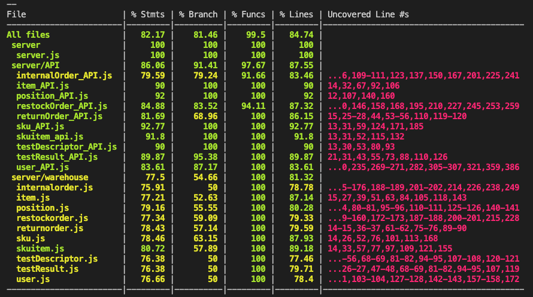

# Integration and API Test Report

Date: 25/05/2022

Version: 1.0

# Contents

- [Dependency graph](#dependency-graph)

- [Integration approach](#integration-approach)

- [Code coverage report](#code-coverage-report)

- [Testing steps](#testing-steps)
  + [DB Testing](#step-1:-testing-the-db)
  + [API Testing](#step-2:-testing-the-apis)

- [Coverage of Functional Requirements](#coverage-of-functional-requirements)

- [Coverage of Non Functional requirements](#coverage-of-non-functional-requirements)

# Dependency graph 

     
# Integration approach

We basically applied an incremental integration with a bottom up approach, as our first step consisted in unit tests on the functions which query directly the database and afterward we moved onto integration tests at the API level, which obviously depend on the DB.
We preferred the bottom up approach over the top down one since in this way we observed directly the lower levels (i.e., the queries on the database) earlier in the process, without having the strict need to have immediately both all the APIs and the services to the DB fully working.

# Code coverage report

We report below the complete code coverage report after running the API tests.
Note that also the files interacting with the DB (those in server/warehouse) are shown in the picture since their queries are called by API functions.

# Testing steps

## Step 1: testing the DB

| Unit name | Jest test case |
|--|--|
|item (DAO)|get item|
|item (DAO)|get items|
|item (DAO)|get not inserted item|
|item (DAO)|duplicated item|
|item (DAO)|item present|
|item (DAO)|item not present|
|item (DAO)|delete item|
|item (DAO)|edit item|
|item (DAO)|supplier already sells this item|
|skuitem (DAO)|get skuitem|
|skuitem (DAO)|get available skuitem by skuid|
|skuitem (DAO)|get skuitems|
|skuitem (DAO)|get not inserted skuitem|
|skuitem (DAO)|duplicated skuitem|
|skuitem (DAO)|skuitem present|
|skuitem (DAO)|skuitem not present|
|skuitem (DAO)|delete skuitem|
|skuitem (DAO)| editSkutem|
|sku (DAO)|sku position already assigned to another sku|
|sku (DAO)|modify position of an sku|
|sku (DAO)|editSku without test descriptors|
|sku (DAO)|editSku with test descriptors|
|sku (DAO)|get sku|
|sku (DAO)|get skus|
|sku (DAO)|get not inserted sku|
|sku (DAO)|sku present|
|sku (DAO)|sku not present|
|sku (DAO)|delete sku|
|testdescriptor (DAO)|get testDescriptor|
|testdescriptor (DAO)|get non existing testDescriptor|
|testdescriptor (DAO)|get all testDescriptors|
|testdescriptor (DAO)|testDescriptor exists|
|testdescriptor (DAO)|edit testDescriptor|
|testdescriptor (DAO)|delete testDescriptor|
|testdescriptor (DAO)|delete all testDescriptors|
|testresult (DAO)|get testResult|
|testresult (DAO)|get non existing testResult|
|testresult (DAO)|get all testResults for rfid|
|testresult (DAO)|testResult exists|
|testresult (DAO)|edit testResult|
|testresult (DAO)|delete testResult|
|testresult (DAO)|delete all testResults|
|position (DAO)|get position|
|position (DAO)|get positions|
|position (DAO)|get not inserted position|
|position (DAO)|duplicated position|
|position (DAO)|position present|
|position (DAO)|position not present|
|position (DAO)|delete position|
|position (DAO)|modify position|
|position (DAO)|modify positionID|
|user (DAO)|get user|
|user (DAO)|get users|
|user (DAO)|get suppliers|
|user (DAO)|get not inserted user|
|user (DAO)|duplicated user|
|user (DAO)|user present|
|user (DAO)|user not present|
|user (DAO)|delete user|
|user (DAO)|modify user|
|restockorder (DAO) | get all restock orders |
|restockorder (DAO) | get issued restock orders |
|restockorder (DAO) | get restock order with id |
|restockorder (DAO) | get restock order products |
|returnorder (DAO) | get all return orders |
|returnorder (DAO) | get all products |
|returnorder (DAO) | get return order with id |
|returnorder (DAO) | delete return order with id |
|returnorder (DAO) | delete all return orders |

## Step 2: testing the APIs
| Unit name  |Mocha test cases |
|--|--|
|sku_API| add or modify sku position but problem: not exist OR not capable OR already assigned|
|sku_API| add or modify sku position and check new and old positions capacities|
|sku_API| modify sku|
|sku_API| modify sku and check if all capacities changed correctly|
|sku_API| get non existing sku|
|sku_API| get multiple skus|
|sku_API| get sku|
|sku_API| store sku|
|sku_API| delete sku|
|skuitem_API| get multiple skuitems with a certain skuid and available|
|skuitem_API|store skuitem not associated to sku|
|skuitem_API|store skuitem|
|skuitem_API|get skuitem|
|skuitem_API|get multiple skuitems|
|skuitem_API|get non existing skuitem|
|skuitem_API|modify skuitem and check|
|skuitem_API|modify skuitem|
|skuitem_API|delete skuitem|
|item_API|store item|
|item_API|get item|
|item_API|get multiple items|
|item_API|get non existing item|
|item_API|modify item and check|
|item_API|modify item|
|item_API|delete item|
|testDescriptor_API|store testDescriptor|
|testDescriptor_API|get testDescriptor|
|testDescriptor_API|get multiple testDescriptors|
|testDescriptor_API|get non existing testDescriptors|
|testDescriptor_API|modify testDescriptor and check|
|testDescriptor_API|modify testDescriptor|
|testDescriptor_API|delete testDescriptor|
|testResult_API|store testResult|
|testResult_API|get testResult|
|testResult_API|get multiple testResults|
|testResult_API|get non existing testResult|
|testResult_API|modify testResult and check|
|testResult_API|modify testResult|
|testResult_API|delete testResult|
|position_API| get multiple positions |
|position_API| store position |
|position_API| modify position |
|position_API| modify positionID |
|position_API| delete position |
|user_API| get user info |
|user_API| get all suppliers |
|user_API| get all users |
|user_API| store user |
|user_API| login manager |
|user_API| login customer |
|user_API| login supplier |
|user_API| login clerk |
|user_API| login quality employee |
|user_API| login delivery employee |
|user_API| logout user |
|user_API| modify user |
|user_API| delete user |

# Coverage of Functional Requirements

| Functional Requirements covered | Mocha  Test(s) | 
| ------------------------------- | ----------- | 
| FR1.1 (create user) | store user |
| FR1.2 (delete user) | delete user |
| FR1.3 (list all users) | get all users |
| FR1.5 (manage rights) | modify user |
| FR3.1.1 (create or modify position) | store position, modify position, modify positionID |
| FR3.1.2 (delete position) | delete position |
| FR3.1.3 (list all positions) | get multiple positions |
| FR3.1.4 (modify attributes of a position) | modify position |
| FR3.2.1 (add a quality test) | store testDescriptor |
| FR3.2.2 (modify a quality test) | modify testDescriptor and check, modify testDescriptor |
| FR3.2.3 (delete a quality test) | delete testDescriptor |
| FR4.1 (register or modify a customer) | store user, modify user |
| FR4.2 (delete a customer) | delete user |
| FR2.1 (create or modify sku) | store sku, modify sku |             
| FR2.2 (delete a sku) | delete sku |
| FR2.3 (list all skus) | get multiple skus |  
| FR2.4 (search a sku) | get sku |  
| FR5.1 (Start a restock order)  |  post new restock order |
| FR5.2 (Add a SKU to a restock order)  | post new restock order |
| FR5.3 (Define quantity of SKU to be ordered)  | post new restock order |
| FR5.5 (Select a Supplier for the restock order)  | post new restock order |
| FR5.6 (Issue  a restock order)  | put new state ... to order ... |
| FR5.7 (Change state of a restock order) | put new state |
| FR5.8 (Manage reception of a restock order) | post new restock order |
| FR5.10 (Return a SKU item listed in a restock order) | get restock order by id = ... |
| FR5.11 (Commit a return order)  | post new return order, post new return order with same restock and 2 skuitems |
| FR6.1 (Start an internal order)  | post new internal order |
| FR6.2 (Add a SKU to an internal order)  | post new internal order |
| FR6.3 (Define quantity of SKU to be ordered)  | post new internal order |
| FR6.5 (Issue an internal order)  | post new internal order |
| FR6.6 (Accept, reject or cancel an internal order) | put new state/skuitems to internal order with id = ... |
| FR6.7 (Change state of an internal order) | put new state/skuitems to internal order with id = ... |
| FR6.8 (Manage delivery of an internal order) | put new state/skuitems to internal order with id = ... |
| FR6.10 (remove a sku) | delete skuitem |  
| FR5.8.1 (create a sku with rfid) | store skuitem  | 
| FR5.8.2 (store result of quality test on sku item) | store testResult | 
| FR5.8.3 (store a skuitem)  | store skuitem |  

# Coverage of Non Functional Requirements

| Non Functional Requirement | Test name |
| -------------------------- | --------- |
| NFR4 (structure of position id) | modify sku and check if all capacities changed correctly, get multiple positions, store position, modify position, modify positionID, delete position |
| NFR6 (structure of RFID) | get skuitem, store skuitem, modify skuitem and check, delete skuitem, get testResult, post testResult, put testResult, delete testResult  |
| NFR9 (date format) |store skuitem, modify skuitem and check,  post new internal order,  post new restock order, post new return order, post testResult, modify testResult |
