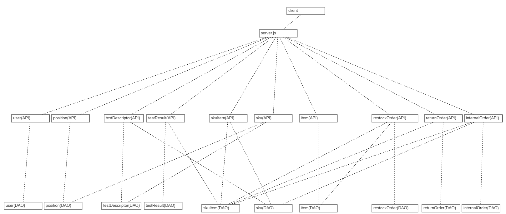

# Integration and API Test Report

Date:

Version:

# Contents

- [Dependency graph](#Dependencygraph)

- [Integration approach](#integration)

- [Tests](#tests)

- [Coverage of scenarios and FR](#scenario-coverage)
- [Coverage of non-functional requirements](#nfr-coverage)

# Dependency graph 

     
# Integration approach

We basically applied an incremental integration with a bottom up approach, as our first step consisted in unit tests on the functions which query directly the database and afterward we moved onto integration tests at the API level, which obviously depend on the DB.
We preferred the bottom up approach over the top down one since in this way we observed directly the lower levels (i.e., the queries on the database) earlier in the process, without having the strict need to have immediately both all the APIs and the services to the DB fully working.

#  Integration Tests

   <define below a table for each integration step. For each integration step report the group of classes under test, and the names of
     Jest test cases applied to them, and the mock ups used, if any> Jest test cases should be here code/server/unit_test

## Step 1: testing the DB

| Unit name | Jest test case |
|--|--|
|item (DAO)|supplier already sells this item|
|item (DAO)|get item|
|item (DAO)|get items|
|item (DAO)|get not inserted item|
|item (DAO)|duplicated item|
|item (DAO)|item present|
|item (DAO)|item not present|
|item (DAO)|delete item|
|item (DAO)|edit item|
|sku (DAO)|sku position already assigned to another sku|
|sku (DAO)|modify position of an sku|
|sku (DAO)|editSku without test descriptors|
|sku (DAO)|editSku with test descriptors|
|sku (DAO)|get sku|
|sku (DAO)|get skus|
|sku (DAO)|get not inserted sku|
|sku (DAO)|sku present|
|sku (DAO)|sku not present|
|sku (DAO)|delete sku|
|skuitem (DAO)|get skuitem|
|skuitem (DAO)|get available skuitem by skuid|
|skuitem (DAO)|get skuitems|
|skuitem (DAO)|get not inserted skuitem|
|skuitem (DAO)|duplicated skuitem|
|skuitem (DAO)|skuitem present|
|skuitem (DAO)|skuitem not present|
|skuitem (DAO)|delete skuitem|
|skuitem (DAO)| editSkutem|

## Step 2: testing the APIs
| Unit name  |Mocha test cases |
|--|--|
|sku_API| add or modify sku position but problem: not exist OR not capable OR already assigned|
|sku_API| add or modify sku position and check new and old positions capacities|
|sku_API| modify sku|
|sku_API| modify sku and check if all capacities changed correctly|
|sku_API| get non existing sku|
|sku_API| get multiple skus|
|sku_API| get sku|
|sku_API| store sku|
|sku_API| delete sku|
|skuitem_API| get multiple skuitems with a certain skuid and available|
|skuitem_API|store skuitem not associated to sku|
|skuitem_API|store skuitem|
|skuitem_API|get skuitem|
|skuitem_API|get multiple skuitems|
|skuitem_API|get non existing skuitem|
|skuitem_API|modify skuitem and check|
|skuitem_API|modify skuitem|
|skuitem_API|delete skuitem|
|item_API|store item|
|item_API|get item|
|item_API|get multiple items|
|item_API|get non existing item|
|item_API|modify item and check|
|item_API|modify item|
|item_API|delete item|

# Coverage of Scenarios and FR

<Report in the following table the coverage of  scenarios (from official requirements and from above) vs FR. 
Report also for each of the scenarios the (one or more) API Mocha tests that cover it. >  Mocha test cases should be here code/server/test

| Functional Requirements covered | Mocha  Test(s) | 
| ------------------------------- | ----------- | 
| FR2.1                             | store sku, modify sku |             
| FR2.2                             | delete sku            |
| FR2.3                             | get multiple skus            |  
| FR2.4                             | get sku            |  
| FR5.8.1                            | store skuitem            | 
| FR5.8.3                            | store skuitem            |   
| FR6.10                           | delete skuitem            |       

# Coverage of Non Functional Requirements

<Report in the following table the coverage of the Non Functional Requirements of the application - only those that can be tested with automated testing frameworks.>

### 

//ho aggiunto quelli interessanti, poi metteremo i nomi dei test che li coprono

| Non Functional Requirement | Test name |
| -------------------------- | --------- |
| NFR4 (structure of position id) | modify sku and check if all capacities changed correctly, //KEVIN AGGIUNGI   |
| NFR6 (structure of RFID) | get skuitem, store skuitem, modify skuitem and check, delete skuitem   |
| NFR9 (date format) |store skuitem, modify skuitem and check, //AGGIUNGETE   |

