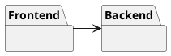
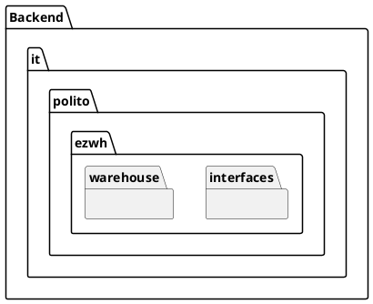
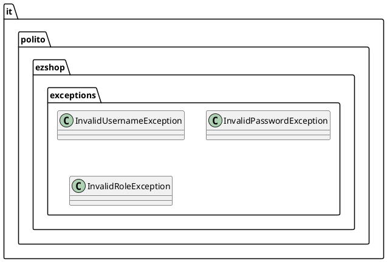

# Design Document 


Authors: Giuliano Bellini, Matteo Guarna, Daniel Calin Panaite, Kevin Macitti

Date: 22/04/22

Version: 0.3


# Contents

- [High level design](#package-diagram)
- [Low level design](#class-diagram)
- [Verification traceability matrix](#verification-traceability-matrix)
- [Verification sequence diagrams](#verification-sequence-diagrams)

# Instructions

The design must satisfy the Official Requirements document, notably functional and non functional requirements, and be consistent with the APIs

# High level design 

Our app is divided between Backend and Frontend. It uses an internal database linked to the Backend.





# Front End

We do not need to implement the GUI as it has already been given to us.

# Back End

The backend is developed using node.js. There will be an API interface called ''.

### Package overview


### Package details



```plantuml
@startuml
package "it.polito.ezwh.data" as warehouse {
    interface "EZWhInterface"
    class EZWh implements EZWhInterface
    interface EmployeeI;
    interface SkuI;
    interface SkuItemI;
    interface TestDescriptorI;
    interface TestResultI;
    interface PositionI;
    interface InternalOrderI;
    interface RestockOrderI;
    interface ReturnOrderI;
    interface ItemI;
    interface UserI;
}

package "it.polito.ezwh.warehouse" as model {
    class Sku implements SkuI;
    class SkuItem implements SkuItemI;
    class TestDescriptor implements TestDescriptorI;
    class TestResult implements TestResultI;
    class Position implements PositionI;
    class InternalOrder implements InternalOrderI;
    class RestockOrder implements RestockOrderI;
    class ReturnOrder implements ReturnOrderI;
    class Item implements ItemI;
    class User implements UserI;
    class Supplier extends User;
    class Employee extends User;
    class Clerk extends Employee;
    class QualityCheckEmployee extends Employee;
    class DeliveryEmployee extends Employee;
    class InternalCustomer extends Employee;
    class Manager extends User;
    class Administrator extends Manager;
}


```


# Low level design

## it.polito.ezwh.data
```plantuml
left to right direction

package "it.polito.ezwh.interfaces" {

class EZWh {


    +List<Sku> getAllSku()
    +Sku getSku(id: int)
    +Sku createSku(description: String, weight: int, volume: int, notes: String, price: float, availableQuantity: int)
    +boolean modifySku(id: int, newAvailableQuantity: int, occupiedWeight: int, occupiedVolume: int)
    +boolean modifySkuPosition(id: int, newPosition: long)
    +boolean deleteSku(id: int)

    +List<SkuItem> getAllSkuItems()
    +List<SkuItem> getAvailableSkuItems(id: int)
    +SkuItem getSkuItem(RFID: long)
    +SkuItem createSkuItem(RFID: long, SKUId: int, DateOfStock: String)
    +boolean modifySkuItemRfid(id: int, RFID: long)
    +boolean deleteSkuItem(id: int)
    
    +List<Position> getAllPositions()
    +Position createPosition(positionID: long, aisleID: int, row: int, col: int, maxWeight: int, maxVolume: int)
    +boolean modifyPosition(positionID: long, aisleID: int, row: int, col: int, maxWeight: int, maxVolume: int)
    +boolean modifyPositionID(positionID: long, newPositionID: long)
    +boolean deletePosition(positionID: long)

    +List<TestDescriptor> getAllTestDescriptors()
    +TestDescriptor getTestDescriptor(TestDescriptorID: int)
    +TestDescriptor createTestDescriptor(name: String, procedureDescriptor: String, SkuId: int)
    +boolean modifyTestDescriptor(TestDescriptorID: int, name: String, procedureDescriptor: String, SkuId: int)
    +boolean deleteTestDescriptor(TestDescriptorID: int)

    +List<TestResult> getAllSkuTestResults(RFID: long)
    +List<TestResult> getSkuTestResult(RFID: long, TestResultID: int)
    +TestResult createTestResult(RFID: long, TestDescriptorID: int, date: String, result: boolean)
    +boolean modifyTestResult(RFID: long, TestResultID: int,  newTestDescriptorID: int, newDate: String, newResult: boolean)
    boolean deleteTestResult(RFID: long, TestResultID: int)

    +String infoUser(UserID: int)
    +List<Supplier> getAllSuppliers();
    +List<User> getAllUsersExceptManagers();
    +User createUser(username: String, name: String, surname: String, password: String, type: String)
    +boolean LoginManager(username: String, password: String)
    +boolean LoginCustomer(username: String, password: String)
    +boolean LogiSupplier(username: String, password: String)
    +boolean LoginClerk(username: String, password: String)
    +boolean LoginQualityEmployee(username: String, password: String)
    +boolean LoginDeliveryEmployee(username: String, password: String)
    +boolean Logout()
    +boolean modifyRights(username: String, newType: String)
    +boolean deleteUser(username: String, type: String)

    +List<RestockOrder> getAllRO()
    +List<RestockOrder> getIssuedRO()
    +RestockOrder getRO(RestockOrderID: int)
    +List<SkuItem> getSkuItemsOfRO(RestockORderID: int)
    +RestockOrder createEmptyRO(RestockOrderID: int, issueDate: String, supplierID: int)
    +boolean modifyRO(RestockOrderID: int, newState: String)
    +boolean addProductsToRO(RestockOrderID: int, products: List<SkuItem>)
    +boolean addNoteToRO(RestockORderID: int, note: String)
    +boolean deleteRO(RestockOrderID: int)

		+List<ReturnOrder> getAllReturnOrders()
		+ReturnOrder getReturnOrder(ReturnOrderID: int)
		+ReturnOrder createReturnOrder(returnDate: String, products: List<SkuItem>)
		+boolean deleteReturnOrder(ReturnORderID: int)
		
		+List<InternalOrder> getAllIO()
		+List<InternalOrder> getIssuedIO()
		+List<InternalOrder> getAcceptedIO()
		+InternalOrder getIO(InternalOrderID: int)
		+InternalOrder createIO(issueDate: String, products: List<SkuItem>, customerID: int)
		+Optional<List<RFID>> modifyStateIO(InternalOrderID: int, newState: String)
		+boolean deleteIO(InternalOrderID: int)
		
		+List<Item> getAllItems()
		+Item getItem(ItemID: int)
		+Item createItem(description: String, price: float, SkuID: int, supplierID: int)
		+boolean modifyItem(ItemID: int, newDescription: String, newPrice: String)
		+boolean deleteItem(ItemID: int)

}

}


```

## it.polito.ezwh.model


# Verification traceability matrix

| | EZWH | User  | InternalOrder | RestockOrder | ReturnOrder | Sku | SkuItem | Item | TestDescriptor | TestResult | Position |
| ------------- |:-------------:| -----:| -----:| -----:| -----:| -----:| -----:| -----:| -----:| -----: | -----: |
| FR1  | <div align="center">X</div> | <div align="center">X</div> | | | | | | | | | | 
| FR2  | <div align="center">X</div> |  | | | | <div align="center">X</div> | | | | | | |
| FR3  | <div align="center">X</div> |  | | |  |  | | | <div align="center">X</div> | <div align="center">X</div> | <div align="center">X</div> | 
| FR4  | <div align="center">X</div> | <div align="center">X</div> | | | | | | | | | | 
| FR5  | <div align="center">X</div> | | | <div align="center">X</div> | <div align="center">X</div> | | <div align="center">X</div>| | | <div align="center">X</div> | |
| FR6  | <div align="center">X</div> |  | <div align="center">X</div> | | | | | | | | | 
| FR7  | <div align="center">X</div> |  | | | | | | <div align="center">X</div> | | | |


# Verification sequence diagrams 
\<select key scenarios from the requirement document. For each of them define a sequence diagram showing that the scenario can be implemented by the classes and methods in the design>

## scenario 1-1

```plantuml
EZWH -> SKU: createSku(description: String, weight: int, volume: int, notes: String, price: float, availableQuantity: int)
SKU -> SKU: setDescription (description: String)
SKU -> SKU: setWeight (weight: int)
SKU -> SKU: setVolume (volume: int)
SKU -> SKU: setNotes (notes: String)
EZWH <-- SKU: SKU created
```

## scenario 1-2

```plantuml
EZWH -> SKU: getSku(id: int)
EZWH <-- SKU: SKU
EZWH -> EZWH: getAvailablePositions()
EZWH -> SKU: modifySkuPosition(id: int, newPosition: long)
SKU -> SKU: setPosition (position: long)
EZWH <-- SKU: SKU position inserted
```

## scenario 1-3

```plantuml
EZWH -> SKU: getSku(id: int)
EZWH <-- SKU: SKU
EZWH -> SKU: modifySku(id: int, newAvailableQuantity: int, occupiedWeight: int, occupiedVolume: int)
SKU -> SKU: setWeight (weight: int)
SKU -> SKU: setVolume (volume: int)
EZWH <-- SKU: SKU weight and volume updated
```

## scenario 2-1

```plantuml
EZWH -> Position: createPosition(positionID: long, aisleID: int, row: int, col: int, maxWeight: int, maxVolume: int)
Position -> Position: setAisle(aisleID: int)
Position -> Position: setRow(row: int)
Position -> Position: setCol(col: int)
Position -> Position: setMaxWeight(maxWeight: int)
Position -> Position: setMaxVolume(maxVolume: int)
EZWH <-- Position: Position created
```

## scenario 2-2

```plantuml
EZWH -> Position: modifyPositionID(positionID: long, newPositionID: long)
Position -> Position: setAisle(aisleID: int)
Position -> Position: setRow(row: int)
Position -> Position: setCol(col: int)
EZWH <-- Position: Position updated
```

## scenario 2-3

```plantuml
EZWH -> Position: getPosition(ID: long)
EZWH <-- Position: Position 
EZWH -> Position: modifyPosition(positionID: long, aisleID: int, row: int, col: int, maxWeight: int, maxVolume: int)
Position -> Position: setMaxWeight(maxWeight: int)
Position -> Position: setMaxVolume(maxVolume: int)
EZWH <-- Position: Position updated
```

## scenario 2-4

```plantuml
EZWH -> Position: getPosition(ID: long)
EZWH <-- Position: Position 
EZWH -> Position: modifyPosition(positionID: long, aisleID: int, row: int, col: int, maxWeight: int, maxVolume: int)
Position -> Position: setAisle(aisleID: int)
Position -> Position: setRow(row: int)
Position -> Position: setCol(col: int)
EZWH <-- Position: Position updated
```
## scenario 2-5

```plantuml
EZWH -> Position: getPosition(ID: long)
EZWH <-- Position: Position 
EZWH -> Position: deletePosition(positionID: long)
EZWH <-- Position: Position deleted
```
