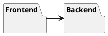
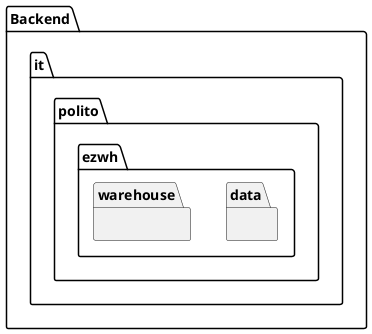
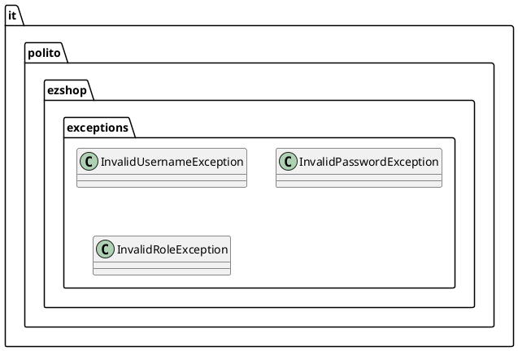
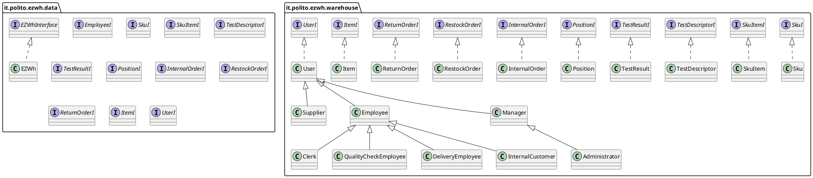

# Design Document 


Authors: Giuliano Bellini, Matteo Guarna, Daniel Calin Panaite, Kevin Mascitti

Date: 22/04/22

Version: 0.3


# Contents

- [High level design](#package-diagram)
- [Low level design](#class-diagram)
- [Verification traceability matrix](#verification-traceability-matrix)
- [Verification sequence diagrams](#verification-sequence-diagrams)

# Instructions

The design must satisfy the Official Requirements document, notably functional and non functional requirements, and be consistent with the APIs

# High level design 

Our app is divided between Backend and Frontend. It uses an internal database linked to the Backend.





# Front End

We do not need to implement the GUI as it has already been given to us.

# Back End

The backend is developed using node.js. 

### Package overview


### Package details






# Low level design

## it.polito.ezwh.data
```plantuml
left to right direction

package "it.polito.ezwh.data" {

class EZWh {


    +List<Sku> getAllSku()
    +Sku getSku(id: int)
    +Sku createSku(description: String, weight: int, volume: int, notes: String, price: float, availableQuantity: int)
    +boolean modifySku(id: int, newAvailableQuantity: int, occupiedWeight: int, occupiedVolume: int)
    +boolean modifySkuPosition(id: int, newPosition: long)
    +boolean deleteSku(id: int)

    +List<SkuItem> getAllSkuItems()
    +List<SkuItem> getAvailableSkuItems(id: int)
    +SkuItem getSkuItem(RFID: long)
    +SkuItem createSkuItem(RFID: long, SKUId: int, DateOfStock: String)
    +boolean modifySkuItemRfid(id: int, RFID: long, newAvailable: int, newDateOfStock: String)
    +boolean deleteSkuItem(id: int)
    
    +List<Position> getAllPositions()
    +Position createPosition(positionID: long, aisleID: int, row: int, col: int, maxWeight: int, maxVolume: int, occupiedWeight: int, occupiedVolume: int)
    +boolean modifyPosition(positionID: long, aisleID: int, row: int, col: int, maxWeight: int, maxVolume: int, occupiedWeight: int, occupiedVolume: int)
    +boolean modifyPositionID(positionID: long, newPositionID: long)
    +boolean deletePosition(positionID: long)

    +List<TestDescriptor> getAllTestDescriptors()
    +TestDescriptor getTestDescriptor(TestDescriptorID: int)
    +TestDescriptor createTestDescriptor(name: String, procedureDescriptor: String, SkuId: int)
    +boolean modifyTestDescriptor(TestDescriptorID: int, name: String, procedureDescriptor: String, SkuId: int)
    +boolean deleteTestDescriptor(TestDescriptorID: int)

    +List<TestResult> getAllSkuTestResults(RFID: long)
    +List<TestResult> getSkuTestResult(RFID: long, TestResultID: int)
    +TestResult createTestResult(RFID: long, TestDescriptorID: int, date: String, result: boolean)
    +boolean modifyTestResult(RFID: long, TestResultID: int,  newTestDescriptorID: int, newDate: String, newResult: boolean)
    boolean deleteTestResult(RFID: long, TestResultID: int)

    +User infoUser(UserID: int)
    +List<Supplier> getAllSuppliers();
    +List<User> getAllUsersExceptManagers();
    +User createUser(username: String, name: String, surname: String, password: String, type: String)
    +boolean LoginManager(username: String, password: String)
    +boolean LoginCustomer(username: String, password: String)
    +boolean LogiSupplier(username: String, password: String)
    +boolean LoginClerk(username: String, password: String)
    +boolean LoginQualityEmployee(username: String, password: String)
    +boolean LoginDeliveryEmployee(username: String, password: String)
    +boolean Logout()
    +boolean modifyRights(username: String, newType: String)
    +boolean deleteUser(username: String, type: String)

    +List<RestockOrder> getAllRO()
    +List<RestockOrder> getIssuedRO()
    +RestockOrder getRO(RestockOrderID: int)
    +List<SkuItem> getSkuItemsOfRO(RestockORderID: int)
    +RestockOrder createEmptyRO(RestockOrderID: int, issueDate: String, supplierID: int)
    +boolean modifyRO(RestockOrderID: int, newState: String)
    +boolean addProductsToRO(RestockOrderID: int, products: List<SkuItem>)
    +boolean addNoteToRO(RestockORderID: int, note: String)
    +boolean deleteRO(RestockOrderID: int)

	+List<ReturnOrder> getAllReturnOrders()
	+ReturnOrder getReturnOrder(ReturnOrderID: int)
	+ReturnOrder createReturnOrder(returnDate: String, products: List<SkuItem>)
	+boolean deleteReturnOrder(ReturnORderID: int)
		
	+List<InternalOrder> getAllIO()
	+List<InternalOrder> getIssuedIO()
	+List<InternalOrder> getAcceptedIO()
	+InternalOrder getIO(InternalOrderID: int)
	+InternalOrder createIO(issueDate: String, products: List<SkuItem>, customerID: int)
	+Optional<List<RFID>> modifyStateIO(InternalOrderID: int, newState: String)
	+boolean deleteIO(InternalOrderID: int)
		
	+List<Item> getAllItems()
	+Item getItem(ItemID: int)
	+Item createItem(description: String, price: float, SkuID: int, supplierID: int)
	+boolean modifyItem(ItemID: int, newDescription: String, newPrice: float)
	+boolean deleteItem(ItemID: int)

}

}


```

## it.polito.ezwh.model


# Verification traceability matrix

| | EZWH | User  | InternalOrder | RestockOrder | ReturnOrder | Sku | SkuItem | Item | TestDescriptor | TestResult | Position |
| ------------- |:-------------:| -----:| -----:| -----:| -----:| -----:| -----:| -----:| -----:| -----: | -----: |
| FR1  | <div align="center">X</div> | <div align="center">X</div> | | | | | | | | | | 
| FR2  | <div align="center">X</div> |  | | | | <div align="center">X</div> | | | | | | |
| FR3  | <div align="center">X</div> |  | | |  |  | | | <div align="center">X</div> | <div align="center">X</div> | <div align="center">X</div> | 
| FR4  | <div align="center">X</div> | <div align="center">X</div> | | | | | | | | | | 
| FR5  | <div align="center">X</div> | | | <div align="center">X</div> | <div align="center">X</div> | | <div align="center">X</div>| | | <div align="center">X</div> | |
| FR6  | <div align="center">X</div> |  | <div align="center">X</div> | | | | | | | | | 
| FR7  | <div align="center">X</div> |  | | | | | | <div align="center">X</div> | | | |


# Verification sequence diagrams 

## scenario 1-1

```plantuml
EZWH -> SKU: createSku(description: String, weight: int, volume: int, notes: String, price: float, availableQuantity: int)
SKU -> SKU: setDescription (description: String)
SKU -> SKU: setWeight (weight: int)
SKU -> SKU: setVolume (volume: int)
SKU -> SKU: setNotes (notes: String)
EZWH <-- SKU: SKU created
```

## scenario 1-2

```plantuml
EZWH -> SKU: getSku(id: int)
EZWH <-- SKU: SKU
EZWH -> EZWH: getAvailablePositions()
EZWH -> SKU: modifySkuPosition(id: int, newPosition: long)
SKU -> SKU: setPosition (position: long)
EZWH <-- SKU: SKU position inserted
```

## scenario 1-3

```plantuml
EZWH -> SKU: getSku(id: int)
EZWH <-- SKU: SKU
EZWH -> SKU: modifySku(id: int, newAvailableQuantity: int, occupiedWeight: int, occupiedVolume: int)
SKU -> SKU: setWeight (weight: int)
SKU -> SKU: setVolume (volume: int)
EZWH <-- SKU: SKU weight and volume updated
```

## scenario 2-1

```plantuml
EZWH -> Position: createPosition(positionID: long, aisleID: int, row: int, col: int, maxWeight: int, maxVolume: int)
Position -> Position: setAisle(aisleID: int)
Position -> Position: setRow(row: int)
Position -> Position: setCol(col: int)
Position -> Position: setMaxWeight(maxWeight: int)
Position -> Position: setMaxVolume(maxVolume: int)
EZWH <-- Position: Position created
```

## scenario 2-2

```plantuml
EZWH -> Position: modifyPositionID(positionID: long, newPositionID: long)
Position -> Position: setAisle(aisleID: int)
Position -> Position: setRow(row: int)
Position -> Position: setCol(col: int)
EZWH <-- Position: Position updated
```

## scenario 2-3

```plantuml
EZWH -> Position: getPosition(ID: long)
EZWH <-- Position: Position 
EZWH -> Position: modifyPosition(positionID: long, aisleID: int, row: int, col: int, maxWeight: int, maxVolume: int)
Position -> Position: setMaxWeight(maxWeight: int)
Position -> Position: setMaxVolume(maxVolume: int)
EZWH <-- Position: Position updated
```

## scenario 2-4

```plantuml
EZWH -> Position: getPosition(ID: long)
EZWH <-- Position: Position 
EZWH -> Position: modifyPosition(positionID: long, aisleID: int, row: int, col: int, maxWeight: int, maxVolume: int)
Position -> Position: setAisle(aisleID: int)
Position -> Position: setRow(row: int)
Position -> Position: setCol(col: int)
EZWH <-- Position: Position updated
```
## scenario 2-5

```plantuml
EZWH -> Position: getPosition(ID: long)
EZWH <-- Position: Position 
EZWH -> Position: deletePosition(positionID: long)
EZWH <-- Position: Position deleted
```

## scenario 3-1

```plantuml
EZWH -> SKU: getSku(id: int)
EZWH <-- SKU: SKU
EZWH -> RestockOrder: createEmptyRO(RestockOrderID: int, issueDate: String, supplierID: int)
RestockOrder -> RestockOrder: setIssueDate(issueDate: String)
RestockOrder -> RestockOrder: setSupplierID(ID: int)
EZWH <-- RestockOrder: Restock order created
EZWH -> RestockOrder: addProductsToRO(RestockOrderID: int, products: List<SkuItem>)
RestockOrder -> RestockOrder: setProductList(products: List<SkuItem>)
EZWH <-- RestockOrder: Product list set
EZWH -> RestockOrder: modifyRO(RestockOrderID: int, newState: String)
RestockOrder -> RestockOrder: setStatus(status: stateRestockOrder)
EZWH <-- RestockOrder: RO recorded in ISSUED state
```

## scenario 4-1

```plantuml
EZWH -> User: createUser(username: String, name: String, surname: String, password: String, type: String)
EZWH <-- User: User is created
EZWH -> User: modifyRights(username: String, newType: String)
EZWH <-- User: User rights are modified
```

## scenario 5-1-1

```plantuml
EZWH -> SKU: getSku(id: int)
EZWH <-- SKU: SKU
EZWH -> RestockOrder: getRO(RestockOrderID: int)
EZWH <-- RestockOrder: RestockOrder
EZWH -> SkuItem: createSkuItem(RFID: long, SKUId: int, DateOfStock: String)
EZWH <-- SkuItem: SkuItem created
EZWH -> RestockOrder: modifyRO(RestockOrderID: int, newState: String)
EZWH <-- RestockOrder: RestockOrder updated to DELIVERED state
```

## scenario 5-2-1

```plantuml
EZWH -> SKU: getSku(id: int)
EZWH <-- SKU: SKU
EZWH -> RestockOrder: getRO(RestockOrderID: int)
EZWH <-- RestockOrder: RestockOrder
EZWH -> SKUItem: getAvailableSkuItems(id: int)
EZWH <-- SKUItem: List<SkuItem>
EZWH -> TestResult: createTestResult(RFID: long, TestDescriptorID: int, date: String, result: boolean)
EZWH <-- TestResult: Recorded positive test result
EZWH -> RestockOrder: modifyRO(RestockOrderID: int, newState: String)
EZWH <-- RestockOrder: RestockOrder updated to TESTED state
```

## scenario 5-3-1

```plantuml
EZWH -> SKU: getSku(id: int)
EZWH <-- SKU: SKU
EZWH -> SKUItem: getAvailableSkuItems(id: int)
EZWH <-- SKUItem: List<SkuItem>
EZWH -> TestResult: getAllSkuTestResults(RFID: long)
EZWH <-- TestResult: List<TestResult>
EZWH -> RestockOrder: getRO(RestockOrderID: int)
EZWH <-- RestockOrder: RestockOrder
EZWH -> SKU: modifySkuPosition(id: int, newPosition: long)
EZWH <-- SKU: modified SKU position
EZWH -> Position: modifyPosition(positionID: long, aisleID: int, row: int, col: int, maxWeight: int, maxVolume: int, occupiedWeight: int, occupiedVolume: int)
EZWH <-- Position: updated Position information
EZWH -> SKU: modifySku(id: int, newAvailableQuantity: int, occupiedWeight: int, occupiedVolume: int)
EZWH <-- SKU: modified available quantity
EZWH -> RestockOrder: modifyRO(RestockOrderID: int, newState: String)
EZWH <-- RestockOrder: RestockOrder updated to COMPLETED state
```

## scenario 6-1

```plantuml
EZWH -> SKU: getSku(id: int)
EZWH <-- SKU: SKU
EZWH -> RestockOrder: getRO(RestockOrderID: int)
EZWH <-- RestockOrder: RestockOrder
EZWH -> ReturnOrder: createReturnOrder(returnDate: String, products: List<SkuItem>)
EZWH <-- ReturnOrder: Return Order created
EZWH -> SKUItem: modifySkuItemRfid(id: int, RFID: long, newAvailable: int, newDateOfStock: String)
EZWH <-- SKUItem: Item set as unavailable
```


## scenario 7-1

```plantuml
EZWH -> User: Login(username: String, password: String)
EZWH <-- User: User logged in
```

## scenario 7-2

```plantuml
EZWH -> User: Logout()
EZWH <-- User: User logged out
```

## scenario 9-1

```plantuml
EZWH -> InternalOrder: createIO(issueDate: String, products: List<SkuItem>, customerID: int)
EZWH <-- InternalOrder: New internal order with products created
EZWH -> InternalOrder: modifyStateIO(InternalOrderID: int, newState: String)
InternalOrder -> InternalOrder: setStatus(status:stateInternalOrder)
EZWH <-- InternalOrder: Internal order state updated to ISSUED
EZWH -> SKU: modifySku(id: int, newAvailableQuantity: int, occupiedWeight: int, occupiedVolume: int)
SKU -> SKU: setAvailableQuantity(quantity: int)
EZWH <-- SKU: SKU quantity updated
EZWH -> Position: modifyPosition(positionID: long, aisleID: int, row: int, col: int, maxWeight: int, maxVolume: int, occupiedWeight: int, occupiedVolume: int)
Position -> Position: setOccupiedWeight (weight: int)
Position -> Position: setOccupiedVolume (volume: int)
EZWH <-- Position: occupied weight and occupied volume updated
EZWH -> InternalOrder: modifyStateIO(InternalOrderID: int, newState: String)
InternalOrder -> InternalOrder: setStatus(status:stateInternalOrder)
EZWH <-- InternalOrder: Internal order state updated to ACCEPTED
```


## scenario 9-2


## scenario 9-3


## scenario 10-1

```plantuml
EZWH -> InternalOrder: getIO(internalOrderID: int)
EZWH <-- InternalOrder: InternalOrder
EZWH -> InternalOrder: getSkuItems()
EZWH <-- InternalOrder: List of SKU items
EZWH -> SkuItem: modifySkuItemRfid(id: int, RFID: long)
EZWH <-- SkuItem: RFID assigned
EZWH -> Sku: modifySku(id: int, newAvailableQuantity: int, occupiedWeight: int, occupiedVolume: int)
EZWH <-- Sku: quantity updated
EZWH -> InternalOrder: modifyStateIO(internalOrderID: int, newState: String)
EZWH <-- InternalOrder: order completed
```

## scenario 11-1

```plantuml
EZWH -> Item: createItem(description: String, price: float, SkuID: int, suppierID: int)
Item -> Item: setDescription(description: String)
Item -> Item: setPrice(price: float)
Item -> Item: setSkuID(skuID: int)
EZWH <-- Item: Item created
```

## scenario 11-2

```plantuml
EZWH -> Item: getItem(ItemID: int)
EZWH <-- Item: Item
EZWH -> Item: modifyItem(itemID: int, newDescription: String, newPrice: float)
Item -> Item: setDescription(description: String)
Item -> Item: setPrice(price: float)
Item -> Item: setSkuID(skuID: int)
EZWH <-- Item: Item's decription and price modified
```

## scenario 12-1

```plantuml
EZWH -> TestDescriptor: createTestDescriptor(name: String, procedureDescriptor: String, SkuID: int)
TestDescriptor -> TestDescriptor: setName(name: String)
TestDescriptor -> TestDescriptor: setProcedureDescriptor(procedureDescriptor: String)
TestDescriptor -> TestDescriptor: setSkuID(SkuID: int)
EZWH <-- TestDescriptor: TestDescriptor created
```

## scenario 12-2

```plantuml
EZWH -> TestDescriptor: getTestDescriptor(TestDescriptorID: int)
EZWH <-- TestDescriptor: TestDescriptor
EZWH -> TestDescriptor: modifyTestDescriptor(TestDescriptorID: int, name: String, procedureDescriptor: String, SkuID: int)
TestDescriptor -> TestDescriptor: setName(name: String)
TestDescriptor -> TestDescriptor: setProcedureDescriptor(procedureDescriptor: String)
TestDescriptor -> TestDescriptor: setSkuID(SkuID: int)
EZWH <-- TestDescriptor: TestDescriptor updated
```

## scenario 12-3

```plantuml
EZWH -> TestDescriptor: getTestDescriptor(TestDescriptorID: int)
EZWH <-- TestDescriptor: TestDescriptor
EZWH -> TestDescriptor: deleteTestDescriptor(TestDescriptorID: int)
EZWH <-- TestDescriptor: TestDescriptor deleted
```
