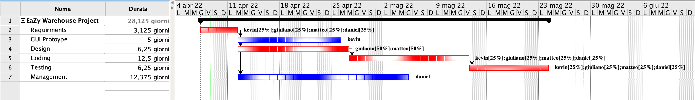

# Project Estimation  
Date: 08/04/22

Version: 1.0

# Estimation approach
Consider the EZWH  project as described in YOUR requirement document, assume that you are going to develop the project INDEPENDENT of the deadlines of the course
# Estimate by size (of entire project)
|             | Estimate                        |
| ----------- | ------------------------------- |
| NC =  Estimated number of classes to be developed   | 20 |
|  A = Estimated average size per class, in LOC       | 200 |
| S = Estimated size of project, in LOC (= NC * A) | 4000 (code = NC*A) + 6000 (other documents) |
| E = Estimated effort, in person hours (here use productivity 10 LOC per person hour)  | 400+600=1000 |
| C = Estimated cost, in euro (here use 1 person hour cost = 30 euro) | 12000+18000=30000 |
| Estimated calendar time, in calendar weeks (Assume team of 4 people, 8 hours per day, 5 days per week ) | 2.5+3.75=6.25 |

# Estimate by product decomposition
|         component name    | Estimated effort (person hours)   |
| ----------- | ------------------------------- |
| requirement document    |100|
| GUI prototype 					|40|
| design document 				|100|
| code 										|400|
| unit tests 							|100|
| api tests 							|100|
| management documents 		|100|

# Estimate by activity decomposition
|         Activity name    | Estimated effort (person hours)   |
| ----------- | ------------------------------- |
| requirements 	|100|
| GUI prototype |40|
| design				|100|
| coding 				|400|
| testing 			|200|
| management  	|100|

Insert here Gantt chart with above activities

# Summary

Report here the results of the three estimation approaches. The estimates may differ. Discuss here the possible reasons for the difference.

|             | Estimated effort                        |   Estimated duration |
| ----------- | ------------------------------- | ---------------|
| estimate by size |1000 hours (10000 LOC)|6.25 weeks|
| estimate by product decomposition |940 hours|4 weeks|
| estimate by activity decomposition |940 hours|4 weeks|

The estimated efforts are quite comparable in terms of hours.

Since the estimation by size does not consider the possibility to parallelize activities, the estimated durations are different. In the Gantt chart we parallelize activities between the 4 team workers while in the estimation by size we just consider serial activities.
