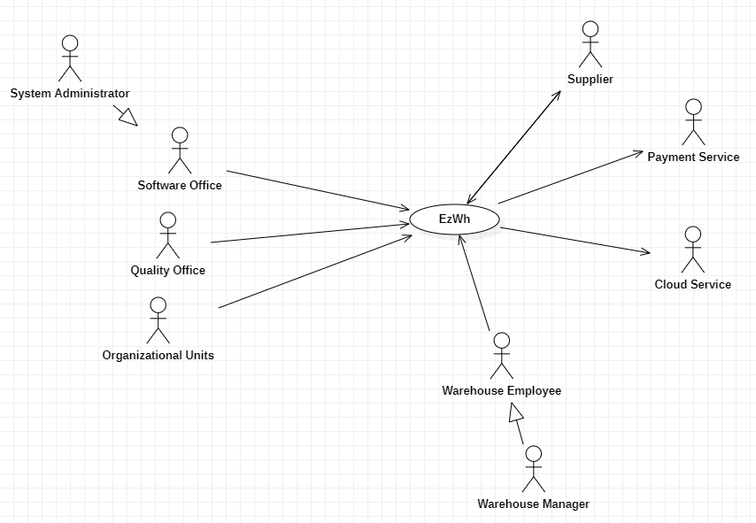
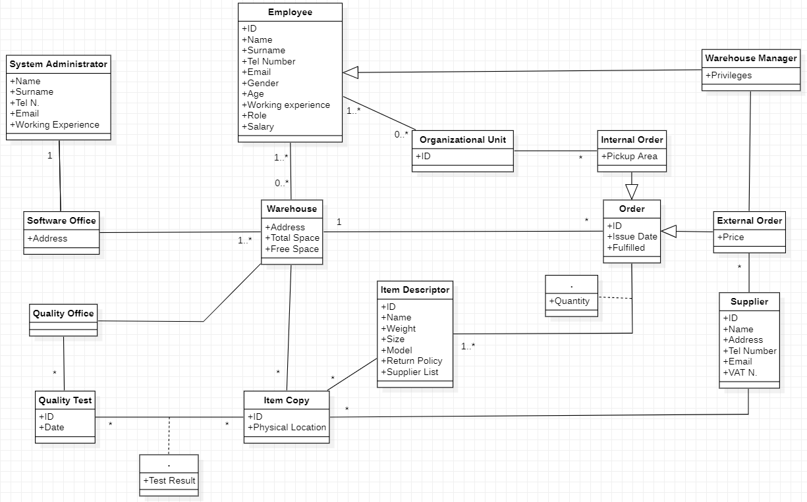
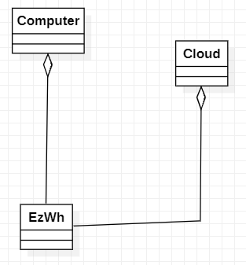
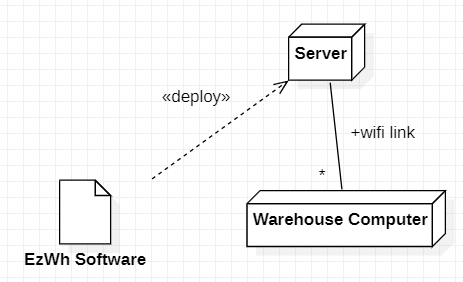

 #Requirements Document 

Date: 2 April 2022

Version: 0.0

 
| Version number | Change |
| ----------------- |:-----------|
| 0.1 | Stakeholders, Context diagram, Functional requirements, Non functional requirements |
| 0.2 | Use case diagram, Glossary diagram, System design, Deployment diagram |
| 0.3 | Use cases and scenarios, Glossary, Stories and personas |
| 0.4 | 

# Contents

- [Informal description](#informal-description)
- [Stakeholders](#stakeholders)
- [Context Diagram and interfaces](#context-diagram-and-interfaces)
	+ [Context Diagram](#context-diagram)
	+ [Interfaces](#interfaces) 
	
- [Stories and personas](#stories-and-personas)
- [Functional and non functional requirements](#functional-and-non-functional-requirements)
	+ [Functional Requirements](#functional-requirements)
	+ [Non functional requirements](#non-functional-requirements)
- [Use case diagram and use cases](#use-case-diagram-and-use-cases)
	+ [Use case diagram](#use-case-diagram)
	+ [Use cases](#use-cases)
    	+ [Relevant scenarios](#relevant-scenarios)
- [Glossary](#glossary)
- [System design](#system-design)
- [Deployment diagram](#deployment-diagram)

# Informal description
Medium companies and retailers need a simple application to manage the relationship with suppliers and the inventory of physical items stocked in a physical warehouse. 
The warehouse is supervised by a manager, who supervises the availability of items. When a certain item is in short supply, the manager issues an order to a supplier. In general the same item can be purchased by many suppliers. The warehouse keeps a list of possible suppliers per item. 

After some time the items ordered to a supplier are received. The items must be quality checked and stored in specific positions in the warehouse. The quality check is performed by specific roles (quality office), who apply specific tests for item (different items are tested differently). Possibly the tests are not made at all, or made randomly on some of the items received. If an item does not pass a quality test it may be rejected and sent back to the supplier. 

Storage of items in the warehouse must take into account the availability of physical space in the warehouse. Further the position of items must be traced to guide later recollection of them.

The warehouse is part of a company. Other organizational units (OU) of the company may ask for items in the warehouse. This is implemented via internal orders, received by the warehouse. Upon reception of an internal order the warehouse must collect the requested item(s), prepare them and deliver them to a pick up area. When the item is collected by the other OU the internal order is completed. 

EZWH (EaSy WareHouse) is a software application to support the management of a warehouse.

# Stakeholders

| Stakeholder name  | Description | 
| ----------------- |:-----------:|
|	Company	| Buys from suppliers and manages warehouses |
|	Retailer	| Same as company but sells to the customers |
|	Supplier	| Provides the goods |
|	Warehouse Manager		| Supervises the warehouse |
|	Warehouse Employee	| Works in the warehouse |
|	Quality Office	| Performs quality checks |
|	Software Office	| Installs, maintains, provides security controls and manages the network of the software |
|	Organizational Unit	| Manages different aspects of the company |	
|	System Administrator	| Manages system privileges |
|	Transport Companies	| Ships the goods from and to the warehouse |
|	Cloud Service	| Provides centralized database |

# Context Diagram and interfaces

## Context Diagram

## Interfaces

| Actor | Logical Interface | Physical Interface  |
| ------------- |:-------------:| -----:|
|   Software Office    | GUI | Keyboard, mouse and screen on PC |
|   Quality Office    | GUI | Keyboard, mouse and screen on PC |
|   Organizational Units    | GUI | Keyboard, mouse and screen on PC |
|   System Administrator    | GUI | Keyboard, mouse and screen on PC |
|   Warehouse Manager    | GUI | Keyboard, mouse and screen on PC |
|   Warehouse Employee    | GUI | Keyboard, mouse and screen on PC |
|   Cloud Service  | API | Internet |
|   Supplier    | Email | Internet |

# Stories and personas

Persona 1: male, 43 years old, married with children. He is the manager of the warehouse. He has high income but he is very stressed. He wants everything to be under control in every moment.
Story: he cheks items quantities and, if the quantity is lower than a fixed threshold, he adds a new external order to a supplier chosen from the list of the suppliers for that item. EzWH sends an automatically generated email to that specific supplier.

Persona 2: female, 35 years old, single. Mid income. She is a warehouse worker who looks for location of the items in the warehouse. She checks that data between warehouse and software are consistent; if not, she modifies information about a certain item. She also communicates with the quality office if she finds failures in items.
Story: a new batch arrives, she manages the order and places items in a specific location of the warehouse and, if the location is not free, she updates warehouse information.

Persona 3: female, 46 years old, married. High income. She is the system administrator who takes order from the administration of the company.
Story: a warehouse worker receives a promotion and becomes manager of the warehouse, she gives him/her the privileges to manage the warehouse and add new orders to the suppliers.

Persona 4: male, 23 years old, single. Low income. He is part of the quality office.
Story: he tests an item; if some tests don't pass, he decides to sends back the item copy or the entire batch, depending on return policy.

Persona 5: male, 30 years old, single. Mid income. He is the worker who receives orders for the supplier company.
Story: the warehouse manager adds a new order for the supplier company, which receives an email automatically generated by EzWH.

Persona 6: female, 39 years old, married. Mid income. She is a warehouse worker who is part of a specific Organizational Unit and manages internal orders.
Story: her Organizational Unit needs items from other OUs, she adds a new internal order for the required items. EzWH sends an automatically generated email to the OU (eventually different OUs).

# Functional and non functional requirements

## Functional Requirements

| ID        | Description  |
| ------------- |:-------------:| 
|  FR1  | Manage warehouse items |
| FR1.1 | Add item |
| FR1.2 | Delete item |
| FR1.3 | Locate item |
| FR1.4 | Modify item information |
| FR1.5 | Supplier list |
|	|	|
|  FR2  | Manage quality check |
| FR2.1 | Define test list for each item |
| FR2.2 | Pick random item for test |
| FR2.3 | Quality check pass |
| FR2.4 | Send back faulty items |
|	|	|
|  FR3  | Manage external orders |
| FR3.1 | Add order and send email to supplier |
| FR3.2 | Check quantity |
| FR3.3 | Refill item stock and email supplier |
|	|	|
|  FR4  | Manage internal order |
| FR4.1 | Add order |
| FR4.2 | Specify pickup area |
| FR4.3 | Acknowledge fulfilled order |
|	|	|
|  FR5  | Manage physical space |
| FR5.1 | Check available space |
| FR5.2 | Organize inventory |
|	|	|
|  FR6  | Manage cloud |
| FR6.1 | Sync warehouse items |
| FR6.2 | Provide backup |
|	|	|
|  FR7  | Manage privileges |
| FR7.1 | Add role |
| FR7.2 | Modify role |
| FR7.3 | Remove role |
|	|	|

## Non Functional Requirements

| ID        | Type (efficiency, reliability, ..)           | Description  | Refers to |
| ------------- |:-------------:| :-----:| -----:|
| NFR1 | Usability | 20 hours needed to learn using the program |  |
| NFR2 | Efficiency | All functions should be executed in less than 0.1 seconds | |
| NFR3 | Correctness | Capability to provide correct functionality in ALL cases | |
| NFR4 | Reliability | Mean time between failures ~ 250 hours | | 
| NFR5 | Security | Protection from malicious users. Access only for authorized users | | 
| NFR6 | Portability | Cross-platform interoperability | | 
| NFR7 | Robustness | Time to restart after failure ~ 5 minutes | |

# Use case diagram and use cases

## Use case diagram

### Use case 1, UC1 - Authentication
| Actors Involved        | Employee |
| ------------- |:-------------:| 
|  Precondition     | User is not authenticated |
|  Post condition     | User is authenticated |
|  Nominal Scenario     | User inputs username and password in GUI page |
|  Variants     | User inputs wrong credentials |

##### Scenario 1.1 

| Scenario | Correct credentials |
| ------------- |:-------------:| 
|  Precondition     | Employee is not authenticated |
|  Post condition     | Employee is logged in and authenticated |
| Step#        | Description  |
|  1     | Employee inserts his username |  
|  2     | Employee inserts his password |
|  3     | Employee is authenticated by the system |

##### Scenario 1.2 

| Scenario | Wrong password |
| ------------- |:-------------:| 
|  Precondition     | Employee is not authenticated |
|  Post condition     | Employee fails to authenticate |
| Step#        | Description  |
|  1     | Employee inserts his username |  
|  2     | Employee inserts wrong password |
|  3     | Employee is not authenticated by the system |

##### Scenario 1.3 

| Scenario | Forgot password |
| ------------- |:-------------:| 
|  Precondition     | Employee is not authenticated and forgot his password |
|  Post condition     | Employee resets a new password |
| Step#        | Description  |
|  1     | Employee asks for a password reset | 
|  2     | Employee inserts his username | 
|  3     | Employee inserts his email |
|  4     | System send an authomatic email to the employee with password reset instructions |

##### Scenario 1.4 

| Scenario | Password attempts exceeded |
| ------------- |:-------------:| 
|  Precondition     | Employee is not authenticated  |
|  Post condition     | Employee fails to authenticate and cannot insert password again |
| Step#        | Description  |
|  1     | Employee inserts his username |  
|  2     | Employee inserts wrong password for the third time in a row |
|  3     | Employee is not authenticated by the system |
|  4     | System informs the employee that he will not able to attempt a new login for the next 60 miutes|

### Use case 2, UC2 - Manage Items
| Actors Involved        | Employee |
| ------------- |:-------------:| 
|  Precondition     | Item exists |
|  Post condition     |  |
|  Nominal Scenario     | Item is added to the warehouse |
|  Variants     | Item already exists and it is modified |
|	| Item already exists and it is deleted |
|	| Item already exists and it is located |
|	| Item already exists. Show supplier list |
|	| Check item quantity |
|	Exception	|	Not enough space in warehouse to add item	|
|	|	Cannot add already existing item	|

##### Scenario 2.1 

| Scenario | New item descriptor added |
| ------------- |:-------------:| 
|  Precondition     | Item descriptor exists |
|  Post condition     | Item descriptor is added to the warehouse |
| Step#        | Description  |
|  1     | Employee specifies attributes of the item descriptor to add (ID, Name, Weight, Size, Model...) |  
|  2     | The item descriptor is added to the warehouse |

##### Scenario 2.2

| Scenario | Existing item descriptor is modified |
| ------------- |:-------------:| 
|  Precondition     | Item exists in the warehouse |
|  Post condition     | One or more item attributes are modified |
| Step#        | Description  |
|  1     | Employee searches for an existing item ID |  
|  2     | The item attributes are displayed |
|  3     | Employee modifies some item attributes |

##### Scenario 2.3

| Scenario | Existing item descriptor is deleted |
| ------------- |:-------------:| 
|  Precondition     | Item exists in the warehouse |
|  Post condition     | Item is deleted from the warehouse |
| Step#        | Description  |
|  1     | Employee searches for an existing item ID |  
|  2     | The item attributes are displayed |
|  3     | Employee deletes item from the warehouse |

##### Scenario 2.4

| Scenario | Existing item is located |
| ------------- |:-------------:| 
|  Precondition     | Item exists in the warehouse |
|  Post condition     | Item has been located inside the warehouse |
| Step#        | Description  |
|  1     | Employee searches for an existing item descriptor ID |  
|  2	 | System locates all the batches |
|  3     | The item attributes (among which its location in the warehouse) are displayed |

##### Scenario 2.5

| Scenario | Show supplier list for an item descriptor |
| ------------- |:-------------:| 
|  Precondition     | Item exists in the warehouse |
|  Post condition     | Item supplier list is displayed |
| Step#        | Description  |
|  1     | Employee searches for an existing item descriptor ID |  
|  2     | The item attributes (among which its supplier list) are displayed |

##### Scenario 2.6

| Scenario | Duplicated item descriptor ID |
| ------------- |:-------------:| 
|  Precondition     | Item exists in the warehouse |
|  Post condition     | Item exists in the warehouse |
| Step#        | Description  |
|  1     | Employee specifies attributes of the item to add (ID, Name, Weight, Size, Model...) | 
|  2     | System fail to add item  |
|  3    | System informs the employee that "ID" is duplicated |

##### Scenario 2.7

| Scenario | Add item batch |
| ------------- |:-------------:| 
|  Precondition     | Item descriptor exists on order arrival |
|  Post condition     | Item is added to the warehouse |
| Step#        | Description  |
|  1	 | Employee specifies item descriptor |
|  2 	 | Employee specifies item batch |
|  3	 | Employee specifies item quantity |
|  4 	 | Employee specifies item location |
|  5     | System adds item batch |

##### Scenario 2.8

| Scenario | Existing item batch is modified |
| ------------- |:-------------:| 
|  Precondition     | Item batch exists in the warehouse |
|  Post condition     | Batch information modified |
| Step#        | Description  |
|  1     | Employee searches for an existing item batch |  
|  2     | The batch info is displayed |
|  3     | Employee modifies batch info |

##### Scenario 2.9

| Scenario | Existing item batch is deleted |
| ------------- |:-------------:| 
|  Precondition     | Item batch exists in the warehouse |
|  Post condition     | Item batch is deleted from the warehouse |
| Step#        | Description  |
|  1     | Employee searches for an existing item batch |
|  3     | System removes batch from warehouse |

##### Scenario 2.10

| Scenario | No physical space available for new item batch |
| ------------- |:-------------:| 
|  Precondition     | Batch is submitted |
|  Post condition     | Item is not added to the warehouse |
| Step#        | Description  |
|  1 	 | System checks available space |
|  2     | System fails to add item |
|  3     | System informs the employee that there is no sufficient physical space in selected sector |

##### Scenario 2.11

| Scenario | Item descriptor not found |
| ------------- |:-------------:| 
|  Precondition     | Item is not in the warehouse |
|  Post condition     | Item is not in the warehouse |
| Step#        | Description  |
|  1     | Employee searches for an item ID |  
|  2     | System fail to retrieve item attributes |
|  3     | System informs the employee that "ID" is invalid |

##### Scenario 2.12

| Scenario | Show item quantity |
| ------------- |:-------------:| 
|  Precondition     | Item exists in the warehouse |
|  Post condition     | Item quantity is displayed |
| Step#        | Description  |
|  1     | Employee searches for an existing item descriptor ID |  
|  2     | The item attributes (among which its  quantity in the warehouse) are displayed |

### Use case 3, UC3 - Manage External Orders
| Actors Involved        | Warehouse Manager |
| ------------- |:-------------:| 
|  Precondition     |  |
|  Post condition     |  |
|  Nominal Scenario     | Manager creates order |
|  Variants     | Existing order is modified |
|	| Existing order is deleted |

##### Scenario 3.1 

| Scenario | Submit new order |
| ------------- |:-------------:| 
|  Precondition     | Warehouse Manager is logged in |
|  Post condition     | Order is submitted to the supplier |
| Step#        | Description  |
|  1     | Manager starts a new order |  
|  2     | Manager insert each item |
|  3     | Manager selects the quantity needed for each items (weight or number of pieces depending on the item) |
|  4     | Manager starts the search |  
|  5     | System shows the various suppliers and the prices they offer for each item and the quantity available |
|  6     | Manager selects the supplier and generates new order |
|  7     | System checks if there is enough space in the warehouse | 
|  8     | An automated E-mail is sent to the supplier |

##### Scenario 3.2 

| Scenario | Not a single supplier is selected to provide for an order |
| ------------- |:-------------:| 
|  Precondition     | Manager has selected the items to apply for |
|  Post condition     | Multiple orders are issued |
| Step#        | Description  |
|  1     | Manager reviews the suppliers, each good, the quantity, the price, and the shipping time |  
|  2     | Manager selects a group of items from one supplier and issues order |
|  3     | Manager repeats the step for each order he/she intends to apply for |
|  4     | Manager starts the orders |
|  5     | An automated E-mail is sent to each supplier |

##### Scenario 3.3 

| Scenario | Smaller batch than expected is ordered |
| ------------- |:-------------:| 
|  Precondition     | A supplier can't provide for one ore more goods in sufficient quantity |
|  Post condition     | Order issued  |
| Step#        | Description  |
|  1     | Manager decides to order the item or items in smaller quanity | 

##### Scenario 3.4 

| Scenario | No supplier found for one or more items |
| ------------- |:-------------:| 
|  Precondition     | Manager has selected the items to apply for and one or more items are not currenty available |
|  Post condition     | Manager can't order the items |
| Step#        | Description  |
|  1     | A message is shown reciting that no supplier is actually being offered | 

##### Scenario 3.5

| Scenario | Not enough space |
| ------------- |:-------------:| 
|  Precondition     | Order is submitted |
|  Post condition     | Manager can't order the items |
| Step#        | Description  |
|  1     | System checks if there is enough space in the warehouse | 
|  2     | Not enough space is available | 
|  2     | Order is refused |

### Use case 4, UC4 - Quality Check
| Actors Involved        | Quality Office |
| ------------- |:-------------:| 
|  Precondition     | Item exists |
|  Post condition     | Item is evaluated |
|  Nominal Scenario     | Item passes quality check |
|  Variants     | Item does not pass quality check |

##### Scenario 4.1 

| Scenario | Item is selected for testing |
| ------------- |:-------------:| 
|  Precondition     | Item batch has arrived to the warehouse |
|  Post condition     | Item is tested |
| Step#        | Description |
|  1     | Item is selected |
|  2     | Item type is checked to decide if and eventually how many items need to be tested to validate the batch | |  
|  3     | Turns out the batch needs to be tested |
|  4     | System provides the details about which tests have to be performed |
|  5     | Employee is selected for the test |

##### Scenario 4.2

| Scenario | Test results are provided to the system |
| ------------- |:-------------:| 
|  Precondition     | Test is performed and result is obtained |
|  Post condition     | System decides what to do of the item batch |
| Step#        | Description  |
|  1     | Test result are provided to the system |  
|  2     | System analyzes the item decription |
|  3     | System gives output (only the items which failed need to be returned / more tests need to be run / the entire batch needs to be returned) |

##### Scenario 4.3

| Scenario | New test is added |
| ------------- |:-------------:| 
|  Precondition     | The employee has the privileges to perform the actions. A new test is defined |
|  Post condition     | A new test is inserted |
| Step#        | Description  |
|  1     | Test name is added |  
|  2     | Test description is added |
|  3     | Suitable items are added |
|  4     | Test is registered |

##### Scenario 4.4

| Scenario | Test is deleted |
| ------------- |:-------------:| 
|  Precondition     | The employee has the privileges to perform the actions. A test is already defined |
|  Post condition     | Test is deleted |
| Step#        | Description  |
|  1     | Test name is added |  
|  2     | Test info are shown |
|  3     | Confirmation is required |
|  4     | Test is deleted |

##### Scenario 4.5

| Scenario | Test is upadated |
| ------------- |:-------------:| 
|  Precondition     | The employee has the privileges to perform the actions. A test is already defined |
|  Post condition     | Test is deleted |
| Step#        | Description  |
|  1     | Test name is added |  
|  2     | Test info are shown |
|  3     | Fields are updated |
|  4     | Confirmation is required |
|  5     | Test is updated |

### Use case 5, UC5 - Manage privileges
| Actors Involved        | System Administrator |
| ------------- |:-------------:| 
|  Precondition     | User exists |
|  Post condition     | User has changed privileges |
|  Nominal Scenario     | System Administrator changes user privileges |

##### Scenario 5.1 

| Scenario | System Administrator creates role with privileges |
| ------------- |:-------------:| 
|  Precondition     | Sysadmin A exists and is authenticated |
|  Post condition     | Role has been created |
| Step#        | Description |
|  1     | A creates role with certain privileges |

##### Scenario 5.2 

| Scenario | System Administrator removes role with privileges |
| ------------- |:-------------:| 
|  Precondition     | Sysadmin A exists and is authenticated |
|  Post condition     | Role has been removed |
| Step#        | Description |
|  1     | A removes role |

##### Scenario 5.3

| Scenario | System Administrator adds role to User |
| ------------- |:-------------:| 
|  Precondition     | Sysadmin A exists and is authenticated |
|  Post condition     | User is assigned a role |
| Step#        | Description |
|  1    | A adds role to User |
|  2	| A informs User of the change |

##### Scenario 5.4

| Scenario | System Administrator removes role from User |
| ------------- |:-------------:| 
|  Precondition     | Sysadmin A exists and is authenticated |
|  Post condition     | User has a role removed |
| Step#        | Description |
|  1    | A removes role from User |
|  2	| A informs User of the change |

##### Scenario 5.5

| Scenario | System Administrator modifies role privileges |
| ------------- |:-------------:| 
|  Precondition     | Sysadmin A exists and is authenticated. Role exists |
|  Post condition     | Role has modified privileges |
| Step#        | Description |
|  1    | A adds or removes privileges from certain role |

##### Scenario 5.6 

| Scenario | System Administrator tries to add role to non existing user |
| ------------- |:-------------:| 
|  Precondition     | Sysadmin A exists and is authenticated. |
|  Post condition     | User roles are not changed |
| Step#        | Description |
|  1     | A tries to add role to a non existing user |
|  2     | System informs A that user does not exist |

### Use case 6, UC6 - Manage Internal Orders
| Actors Involved        | Organizational Units |
| ------------- |:-------------:| 
|  Precondition     | Items in order exist |
|  Post condition     | Order has been created |
|  Nominal Scenario     | OU creates internal order |
|	Exception	|	Not enough items to complete order 	|

##### Scenario 6.1 

| Scenario | OU creates a new internal order |
| ------------- |:-------------:| 
|  Precondition     | OU is logged into the system |
|  Post condition     | New internal order is created |
| Step#        | Description |
|  1     | OU adds items to the order |
|  2     | OU defines order pickup area |
|  3     | System checks item availability |
|  4	 | Internal order is created |
|  5	 | Automated email is sent to OU |

##### Scenario 6.2 

| Scenario | OU updates internal order |
| ------------- |:-------------:| 
|  Precondition     | OU is logged into the system |
|  Post condition     | Internal order is updated |
| Step#        | Description |
|  1     | OU adds or removes items from order |
|  2     | OU defines order pickup area |
|  3     | System checks item availability |
|  4	 | Internal order is updated |

##### Scenario 6.3 

| Scenario | OU fails to update internal order |
| ------------- |:-------------:| 
|  Precondition     | OU is logged into the system |
|  Post condition     | Internal order is not updated |
| Step#        | Description |
|  1     | OU adds or removes items from order |
|  2     | OU defines order pickup area |
|  3     | System checks item availability |
|  4	 | System informs OU that order has already been completed |
|  5	 | Internal order cannot be updated after fulfillment |

##### Scenario 6.4 

| Scenario | OU cancels internal order |
| ------------- |:-------------:| 
|  Precondition     | OU is logged into the system |
|  Post condition     | Internal order is cancelled |
| Step#        | Description |
|  1     | OU cancels internal order |
|  2     | Internal order is cancelled |

##### Scenario 6.5 

| Scenario | OU fails to cancel internal order |
| ------------- |:-------------:| 
|  Precondition     | OU is logged into the system |
|  Post condition     | Internal order is not cancelled |
| Step#        | Description |
|  1     | OU cancels internal order |
|  2     | System informs OU that order cannot be cancelled after fulfillment |
|  3	 | Internal order is not cancelled |

##### Scenario 6.6 

| Scenario | OU confirms recieved order |
| ------------- |:-------------:| 
|  Precondition     | OU is logged into the system |
|  Post condition     | Internal order is labeled as fulfilled |
| Step#        | Description |
|  1     | OU confirms order is recieved |
|  2     | System labels order as fulfilled |

##### Scenario 6.7 

| Scenario | OU fails to create order |
| ------------- |:-------------:| 
|  Precondition     | OU is logged into the system |
|  Post condition     | Internal order is not created |
| Step#        | Description |
|  1     | OU adds items to the order |
|  2     | OU defines order pickup area |
|  3     | System checks item availability |
|  4	 | Items are not available |
|  5	 | Internal order cannot be created or OU has to adjust item quantity |

# Glossary

Working experience: expressed in terms of years of work in the same company.

Total space: total volume ($m^3$) in the physical warehouse dedicated to item copies.

Free space: available volume ($m^3$) in the physical warehouse dedicated to item copies.

Physical location: identifies the exact place where a specific item is put in the warehouse. It is identified by two numbers. The first represents the sector, the second represents the height in the sector.

Salary: expressed in terms of dollars.

Privileges: base (can update warehouse and items information), manager (it can also manage orders), administrator (it can manage software and change employee privileges).

Weight: expressed in terms of kg.

Volume: expressed in terms of $m^3$.

Model: represents the main information of the item. Two items could have the same name but different models.

Return policy: determines whether to return the single item or the entire batch.

Pickup area: the physical location in the company warehouse where internal orders have to be sent.

Shipping time: expressed in terms of working days.

# System Design
\<describe here system design>

# Deployment Diagram 

