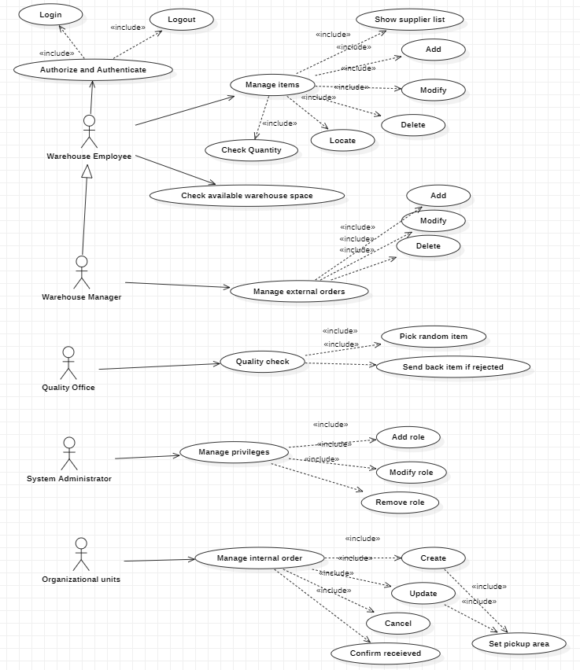
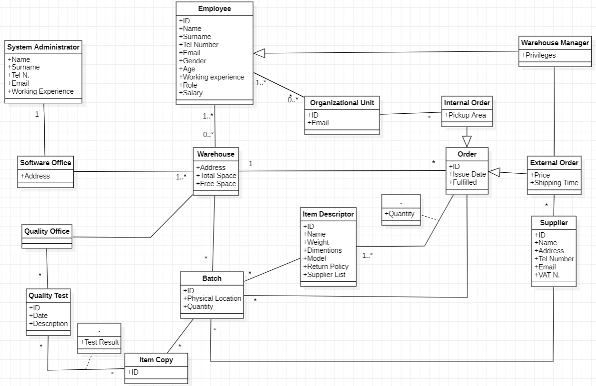

 #Requirements Document 

Date: 2 April 2022

Version: 0.0

 
| Version number | Change |
| ----------------- |:-----------|
| | | 

# Contents

- [Informal description](#informal-description)
- [Stakeholders](#stakeholders)
- [Context Diagram and interfaces](#context-diagram-and-interfaces)
	+ [Context Diagram](#context-diagram)
	+ [Interfaces](#interfaces) 
	
- [Stories and personas](#stories-and-personas)
- [Functional and non functional requirements](#functional-and-non-functional-requirements)
	+ [Functional Requirements](#functional-requirements)
	+ [Non functional requirements](#non-functional-requirements)
- [Use case diagram and use cases](#use-case-diagram-and-use-cases)
	+ [Use case diagram](#use-case-diagram)
	+ [Use cases](#use-cases)
    	+ [Relevant scenarios](#relevant-scenarios)
- [Glossary](#glossary)
- [System design](#system-design)
- [Deployment diagram](#deployment-diagram)

# Informal description
Medium companies and retailers need a simple application to manage the relationship with suppliers and the inventory of physical items stocked in a physical warehouse. 
The warehouse is supervised by a manager, who supervises the availability of items. When a certain item is in short supply, the manager issues an order to a supplier. In general the same item can be purchased by many suppliers. The warehouse keeps a list of possible suppliers per item. 

After some time the items ordered to a supplier are received. The items must be quality checked and stored in specific positions in the warehouse. The quality check is performed by specific roles (quality office), who apply specific tests for item (different items are tested differently). Possibly the tests are not made at all, or made randomly on some of the items received. If an item does not pass a quality test it may be rejected and sent back to the supplier. 

Storage of items in the warehouse must take into account the availability of physical space in the warehouse. Further the position of items must be traced to guide later recollection of them.

The warehouse is part of a company. Other organizational units (OU) of the company may ask for items in the warehouse. This is implemented via internal orders, received by the warehouse. Upon reception of an internal order the warehouse must collect the requested item(s), prepare them and deliver them to a pick up area. When the item is collected by the other OU the internal order is completed. 

EZWH (EaSy WareHouse) is a software application to support the management of a warehouse.

# Stakeholders

| Stakeholder name  | Description | 
| ----------------- |:-----------:|
|	Company	| Buys from suppliers and manages warehouses |
|	Retailer	| Same as company but sells to the customers |
|	Supplier	| Provides the goods |
|	Warehouse Manager		| Supervises the warehouse |
|	Warehouse Employee	| Works in the warehouse |
|	Quality Office	| Performs quality checks |
|	Software Office	| Installs, maintains, provides security controls and manages the network of the software |
|	Organizational Unit	| Manages different aspects of the company |	
|	System Administrator	| Manages system privileges |
|	Transport Companies	| Ships the goods from and to the warehouse |
|	Cloud Service	| Provides centralized database |

# Context Diagram and interfaces

## Context Diagram

## Interfaces

| Actor | Logical Interface | Physical Interface  |
| ------------- |:-------------:| -----:|
|   Software Office    | GUI | Keyboard, mouse and screen on PC |
|   Quality Office    | GUI | Keyboard, mouse and screen on PC |
|   Organizational Units    | GUI | Keyboard, mouse and screen on PC |
|   System Administrator    | GUI | Keyboard, mouse and screen on PC |
|   Warehouse Manager    | GUI | Keyboard, mouse and screen on PC |
|   Warehouse Employee    | GUI | Keyboard, mouse and screen on PC |
|   Cloud Service  | API | Internet |
|   Supplier    | Email | Internet |

# Stories and personas
\<A Persona is a realistic impersonation of an actor. Define here a few personas and describe in plain text how a persona interacts with the system>

\<Persona is-an-instance-of actor>

\<stories will be formalized later as scenarios in use cases>

# Functional and non functional requirements

## Functional Requirements

| ID        | Description  |
| ------------- |:-------------:| 
|  FR1     | Manage warehouse items |
|  FR1.1     | Add item |
|       | Delete item |
|       | Locate item |
|       | Modify item information |
|       | Supplier list |
|       |  |
|       |  |
|  FR2     | Manage quality check |
|       | Define test list for each item |
|       | Pick random item for test |
|       | Quality check pass |
|       | Send back faulty items |
|       |  |
|  FR3     | Manage external orders |
|       | Add order and send email to supplier |
|       | Check quantity |
|       | Refill item stock and email supplier |
|       |  |
|  FR4     | Manage internal order |
|       | Add order |
|       | Specify pickup area |
|       | Acknowledge fulfilled order |
|       |  |
|  FR5     | Manage physical space |
|       | Check available space |
|       | Organize inventory |
|       |  |
|  FR6     | Manage cloud |
|       | Sync warehouse items |
|       | Provide backup |
|       |  |
|   FR7    | Manage privileges |
|       | Add role |
|       | Modify role |
|       | Remove role |
|       |  |

## Non Functional Requirements

| ID        | Type (efficiency, reliability, ..)           | Description  | Refers to |
| ------------- |:-------------:| :-----:| -----:|
|  NFR1     | Usability | 20 hours needed to learn using the program |  |
|  NFR2     | Efficiency | All functions should be executed in less than 0.1 seconds |  |
|  NFR3     | Correctness | Capability to provide correct functionality in ALL cases | |
| NFR4 | Reliability | Mean time between failures ~ 250 hours | | 
| NFR5 | Security | Protection from malicious users. Access only for authorized users | | 
| NFR6 | Portability | Cross-platform interoperability | | 
| NFR7 | Robustness | Time to restart after failure ~ 5 minutes | |  

# Use case diagram and use cases

## Use case diagram

### Use case 1, UC1 - Authentication
| Actors Involved        | Employee |
| ------------- |:-------------:| 
|  Precondition     | User is not authenticated |
|  Post condition     | User is authenticated |
|  Nominal Scenario     | User inputs username and password in GUI page |
|  Variants     | User inputs wrong credentials |

##### Scenario 1.1 

| Scenario | Correct credentials |
| ------------- |:-------------:| 
|  Precondition     | Employee is not authenticated |
|  Post condition     | Employee is logged in and authenticated |
| Step#        | Description  |
|  1     | Employee inserts his username |  
|  2     | Employee inserts his password |
|  3     | Employee is authenticated by the system |

##### Scenario 1.2 

| Scenario | Wrong password |
| ------------- |:-------------:| 
|  Precondition     | Employee is not authenticated |
|  Post condition     | Employee fails to authenticate |
| Step#        | Description  |
|  1     | Employee inserts his username |  
|  2     | Employee inserts wrong password |
|  3     | Employee is not authenticated by the system |

##### Scenario 1.3 

| Scenario | Forgot password |
| ------------- |:-------------:| 
|  Precondition     | Employee is not authenticated and forgot his password |
|  Post condition     | Employee resets a new password |
| Step#        | Description  |
|  1     | Employee asks for a password reset | 
|  2     | Employee inserts his username | 
|  3     | Employee inserts his email |
|  4     | System send an authomatic email to the employee with password reset instructions |

##### Scenario 1.4 

| Scenario | Password attempts exceeded |
| ------------- |:-------------:| 
|  Precondition     | Employee is not authenticated  |
|  Post condition     | Employee fails to authenticate and cannot insert password again |
| Step#        | Description  |
|  1     | Employee inserts his username |  
|  2     | Employee inserts wrong password for the third time in a row |
|  3     | Employee is not authenticated by the system |
|  4     | System informs the employee that he will not able to attempt a new login for the next 60 miutes|

### Use case 2, UC2 - Manage Items
| Actors Involved        | Employee |
| ------------- |:-------------:| 
|  Precondition     | Item exists |
|  Post condition     |  |
|  Nominal Scenario     | Item is added to the warehouse |
|  Variants     | Item already exists and it is modified |
|	| Item already exists and it is deleted |
|	| Item already exists and it is located |
|	| Item already exists. Show supplier list |
|	| Check item quantity |
|	Exception	|	Not enough space in warehouse to add item	|
|	|	Cannot add already existing item	|

##### Scenario 2.1 

| Scenario | New item added |
| ------------- |:-------------:| 
|  Precondition     | Item exists |
|  Post condition     | Item is added to the warehouse |
| Step#        | Description  |
|  1     | Employee specifies attributes of the item to add (ID, Name, Weight, Size, Model...) |  
|  2     | The item is added to the warehouse |

##### Scenario 2.2

| Scenario | Existing item is modified |
| ------------- |:-------------:| 
|  Precondition     | Item exists in the warehouse |
|  Post condition     | One or more item attributes are modified |
| Step#        | Description  |
|  1     | Employee searches for an existing item ID |  
|  2     | The item attributes are displayed |
|  3     | Employee modifies some item attributes |

##### Scenario 2.3

| Scenario | Existing item is deleted |
| ------------- |:-------------:| 
|  Precondition     | Item exists in the warehouse |
|  Post condition     | Item is deleted from the warehouse |
| Step#        | Description  |
|  1     | Employee searches for an existing item ID |  
|  2     | The item attributes are displayed |
|  3     | Employee deletes item from the warehouse |

##### Scenario 2.4

| Scenario | Existing item is located |
| ------------- |:-------------:| 
|  Precondition     | Item exists in the warehouse |
|  Post condition     | Item has been located inside the warehouse |
| Step#        | Description  |
|  1     | Employee searches for an existing item ID |  
|  2     | The item attributes (among which its location in the warehouse) are displayed |

##### Scenario 2.5

| Scenario | Show supplier list |
| ------------- |:-------------:| 
|  Precondition     | Item exists in the warehouse |
|  Post condition     | Item supplier list is displayed |
| Step#        | Description  |
|  1     | Employee searches for an existing item ID |  
|  2     | The item attributes (among which its supplier list) are displayed |

##### Scenario 2.6

| Scenario | Duplicated ID |
| ------------- |:-------------:| 
|  Precondition     | Item exists in the warehouse |
|  Post condition     | Item exists in the warehouse |
| Step#        | Description  |
|  1     | Employee specifies attributes of the item to add (ID, Name, Weight, Size, Model...) | 
|  2     | System fail to add item  |
|  3    | System informs the employee that "ID" is duplicated |

##### Scenario 2.7

| Scenario | No physical space available for new item |
| ------------- |:-------------:| 
|  Precondition     | Item exists |
|  Post condition     | Item is not added to the warehouse |
| Step#        | Description  |
|  1     | Employee specifies attributes of the item to add (ID, Name, Weight, Size, Model...) | 
|  2     | System fail to add item  |
|  3    | System informs the employee that there is no sufficient physical space |

##### Scenario 2.8

| Scenario | Item not present |
| ------------- |:-------------:| 
|  Precondition     | Item is not in the warehouse |
|  Post condition     | Item is not in the warehouse |
| Step#        | Description  |
|  1     | Employee searches for an item ID |  
|  2     | System fail to retrieve item attributes |
|  3    | System informs the employee that "ID" is invalid |

##### Scenario 2.9

| Scenario | Show item quantity |
| ------------- |:-------------:| 
|  Precondition     | Item exists in the warehouse |
|  Post condition     | Item quantity is displayed |
| Step#        | Description  |
|  1     | Employee searches for an existing item ID |  
|  2     | The item attributes (among which its  quantity in the warehouse) are displayed |

### Use case 3, UC3 - Manage External Orders
| Actors Involved        | Warehouse Manager |
| ------------- |:-------------:| 
|  Precondition     |  |
|  Post condition     |  |
|  Nominal Scenario     | Manager creates order |
|  Variants     | Existing order is modified |
|	| Existing order is deleted |

### Use case 4, UC4 - Quality Check
| Actors Involved        | Quality Office |
| ------------- |:-------------:| 
|  Precondition     | Item exists |
|  Post condition     | Item is evaluated |
|  Nominal Scenario     | Item passes quality check |
|  Variants     | Item does not pass quality check |

### Use case 5, UC5 - Manage privileges
| Actors Involved        | System Administrator |
| ------------- |:-------------:| 
|  Precondition     | User exists |
|  Post condition     | User has changed privileges |
|  Nominal Scenario     | System Administrator changes user privileges |

### Use case 6, UC6 - Manage Internal Orders
| Actors Involved        | Organizational Units |
| ------------- |:-------------:| 
|  Precondition     | Items in order exist |
|  Post condition     | Order has been created |
|  Nominal Scenario     | OU creates internal order |
|	Exception	|	Not enough items to complete order 	|

# Glossary

# System Design
\<describe here system design>

# Deployment Diagram 

