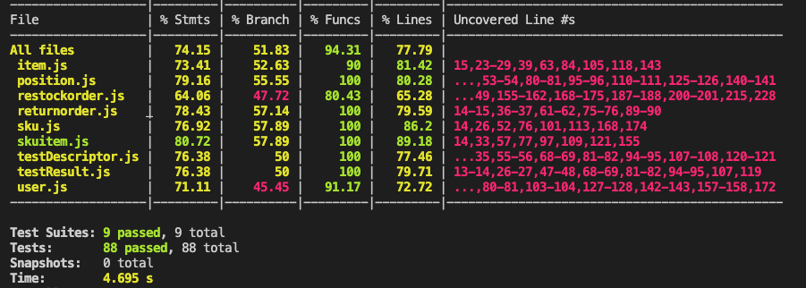

# Unit Testing Report

Date:

Version:

# Contents

- [Black Box Unit Tests](#black-box-unit-tests)

- [White Box Unit Tests](#white-box-unit-tests)
    + [Code coverage report](#code-coverage-report)

# Black Box Unit Tests

 ### **Class *item* - method *getStoredItem***

**Criteria for method *getStoredItem*:**
	
- Sign of id

**Predicates for method *getStoredItem*:**

| Criteria              | Predicate |
| ------------------------ | --------- |
| Sign of id  |   (0, maxint)   |
|                          |(minint, 0)     |

**Boundaries**:

| Criteria | Boundary values |
| --------- | --------------- |
|   Sign of id        |  1               |
|   Sign of id        |  -1               |

**Combination of predicates**:

| Sign of id | Valid / Invalid | Description of the test case |
|-------|-------|-------|
|(minint, 0)|Invalid|T1(-5) -> Error|
| (0, maxint) |Valid|T2(3) -> Ok|

 ### **Class *item* - method *modifyStoredItem***

**Criteria for method *modifyStoredItem*:**
	
- Sign of id
- Sign of newPrice

**Predicates for method *modifyStoredItem*:**

| Criteria              | Predicate |
| ------------------------ | --------- |
| Sign of id  |  (0, maxint)    |
|                          |(minint, 0)     |
| Sign of newPrice  |  (0, maxint)  |
|                          |(minint, 0)   |

**Boundaries**:

| Criteria | Boundary values |
| --------- | --------------- |
|   Sign of id        |  1               |
|   Sign of id        |  -1               |
|   Sign of newPrice        |  0.001               |
|   Sign of newPrice        |  -0.001             |

**Combination of predicates**:

| Sign of id | Sign of newPrice | Valid / Invalid | Description of the test case |
|-------|-------|-------|--------|
|(minint, 0)|(minint, 0) |Invalid|T1(-5,-9.99,"new description") -> Error|
|(minint, 0)|(0, maxint) |Invalid|T2(-5,9.99,"new description") -> Error|
|(0, maxint)|(minint, 0) |Invalid|T3(2,-9.99,"new description") -> Error|
|(0, maxint)|(0, maxint) |Valid|T4(2,-9.99,"new description") -> Ok|

 ### **Class *item* - method *storeItem***

 **Criteria for method *storeItem*:**
	
- Sign of id
- Sign of price
- Sign of skuId
- Sign of supplierId

**Predicates for method *storeItem*:**

| Criteria              | Predicate |
| ------------------------ | --------- |
| Sign of id  |   (0, maxint)   |
|                          |(minint, 0)     |
| Sign of newPrice  |  (0, maxint)    |
|                          |(minint, 0)     |
| Sign of skuId  |   (0, maxint)   |
|                          |(minint, 0)     |
| Sign of supplierId  |  (0, maxint)    |
|                          |(minint, 0)     |

**Boundaries**:

| Criteria | Boundary values |
| --------- | --------------- |
|   Sign of id        |  1               |
|   Sign of id        |  -1               |
|   Sign of newPrice        |  0.001               |
|   Sign of newPrice        |  -0.001             |
|   Sign of skuId        |  1               |
|   Sign of skuId        |  -1               |
|   Sign of supplierId        |  1               |
|   Sign of supplierId        |  -1               |

**Combination of predicates**:

| Sign of id | Sign of newPrice | Sign of skuid | Sign of supplierId | Valid / Invalid | Description of the test case |
|-------|-------|-------|--------|-----|------|
|(minint, 0)| * | * | *  |Invalid|T1(-5,9.99,"description",1,2) -> Error|
|*| (minint, 0) | * | *  |Invalid|T1(5,-9.99,"description",1,2) -> Error|
|*| * | (minint, 0) | *  |Invalid|T1(5,9.99,"description",-1,2) -> Error|
|*| * | * | (minint, 0)  |Invalid|T1(5,9.99,"description",1,-2) -> Error|
|(0, maxint)| (0, maxint) | (0, maxint) | (0, maxint)  |Valid|T1(5,9.99,"description",1,2) -> Ok|

### **Class *sku* - method *storeSku***

 **Criteria for method *storeSku*:**
	
- Sign of weight
- Sign of volume
- Sign of price
- Sign of availableQuantity

**Predicates for method *storeSku*:**

| Criteria              | Predicate |
| ------------------------ | --------- |
| Sign of weight  |   (0, maxint)   |
|                          |(minint, 0)     |
| Sign of volume  |  (0, maxint)    |
|                          |(minint, 0)     |
| Sign of price  |  (0, maxint)   |
|                          | (minint, 0)     |
| Sign of availableQuantity  | (0, maxint)     |
|                          | (minint, 0)    |

**Boundaries**:

| Criteria | Boundary values |
| --------- | --------------- |
|   Sign of availableQuantity        |  1               |
|   Sign of availableQuantity        |  -1               |
|   Sign of weight        |  0.001               |
|   Sign of weight        |  -0.001             |
|   Sign of volume        |  0.001               |
|   Sign of volume        |  -0.001               |
|   Sign of price        |  0.001               |
|   Sign of price        |  -0.001               |

**Combination of predicates**:

| Sign of weight | Sign of volume | Sign of price | Sign of availableQuantity | Valid / Invalid | Description of the test case |
|-------|-------|-------|--------|-----|------|
|(minint, 0)| * | * | *  |Invalid|T1("a new sku",-50,90,9.99,20) -> Error|
|*| (minint, 0) | * | *  |Invalid|T2("a new sku",50,-90,9.99,20) -> Error|
|*| * | (minint, 0) | *  |Invalid|T3("a new sku",50,90,-9.99,20) -> Error|
|*| * | * | (minint, 0)  |Invalid|T4("a new sku",50,90,9.99,-20) -> Error|
|(0, maxint)| (0, maxint) | (0, maxint) | (0, maxint)  |Valid|T5("a new sku",50,90,9.99,20) -> Ok|

### **Class *skuitem* - method *getStoredSkuitem***

**Criteria for method *getStoredSkuitem*:**
	
- Length of RFID

**Predicates for method *getStoredSkuitem*:**

| Criteria              | Predicate |
| ------------------------ | --------- |
| Length of RFID  | 32     |
|                 | !=32   |

**Boundaries**:

| Criteria | Boundary values |
| --------- | --------------- |
|   Lenght of RFID        |  12345678123456781234567812345678 (32 digits) |
|   Length of RFID        |  123456781234567812345678123456781  (33 digits)|
|   Length of RFID        |  1234567812345678123456781234567  (31 digits)|

**Combination of predicates**:

| Length of RFID | Valid / Invalid | Description of the test case |
|-------|-------|-------|
|32 digits|Valid|T1(12345678123456781234567812345678) -> Ok|
|31 digits|Invalid|T1(1234567812345678123456781234567) -> Error|
|33 digits|Invalid|T1(123456781234567812345678123456781) -> Error|

 ### **Class *skuitem* - method *storeSkuitem***

 **Criteria for method *storeSkuitem*:**
	
- Length of RFID
- Value of Available
- Sign of skuId
- Format of DateOfStock

**Predicates for method *storeSkuitem*:**

| Criteria              | Predicate |
| ------------------------ | --------- |
| Length of RFID  | 32     |
|                          | !=32     |
| Value of Available  | == 0 OR == 1     |
|                          | !=0 AND !=1     |
| Sign of skuId  |   (0, maxint)   |
|                          |(minint, 0)     |
| Format of DateOfStock  | valid date     |
|                          |invalid date     |

**Boundaries**:

| Criteria | Boundary values |
| --------- | --------------- |
|   Lenght of RFID        |  12345678123456781234567812345678 (32 digits) |
|   Length of RFID        |  123456781234567812345678123456781  (33 digits)|
|   Length of RFID        |  1234567812345678123456781234567  (31 digits)|
|   Sign of skuId        |  1               |
|   Sign of skuId        |  -1               |

**Combination of predicates**:

| Length of RFID | Value of Available | Sign of skuid | Format of DateOfStock | Valid / Invalid | Description of the test case |
|-------|-------|-------|--------|-----|------|
|!=32 | * | * | *  |Invalid|T1(46473847434,1,1,19/05/2022) -> Error|
|*| !=0 AND !=1 | * | *  |Invalid|T2(12345678123456781234567812345678,5,1,19/05/2022) -> Error|
|*| * | (minint, 0) | *  |Invalid|T3(12345678123456781234567812345678,1,-1,19/05/2022) -> Error|
|*| * | * | invalid DateOfStock  |Invalid|T4(12345678123456781234567812345678,1,1,1932/2205/2022) -> Error|
|==32| ==0 OR ==1 | (0, maxint) | valid DateOfStock  |Valid|T5(12345678123456781234567812345678,0,1,19/05/2022) -> Ok|

### **Class *testResult* - method *storeTestResult***

 **Criteria for method *storeTestResult*:**
	
- Length of RFID
- Sign of idTestDescriptor
- Format of Date

**Predicates for method *storeTestResult*:**

| Criteria              | Predicate |
| ------------------------ | --------- |
| Length of RFID  | 32     |
|                          | !=32     |
| Sign of idTestDescriptor  | (0, maxint) |
|                          | (minint, 0)  |
| Format of Date  | date |
|                          | invalid date  |

**Boundaries**:

| Criteria | Boundary values |
| --------- | --------------- |
|   Length of RFID        |  12345678123456781234567812345678 (32 digits) |
|   Length of RFID        |  123456781234567812345678123456781  (33 digits)|
|   Length of RFID        |  1234567812345678123456781234567  (31 digits)|
|   Sign of idTestDescriptor        |  1               |
|   Sign of idTestDescriptor        |  -1               |

**Combination of predicates**:

| Length of RFID | Sign of idTestDescriptor | Format of DateOfStock | Valid / Invalid | Description of the test case |
|-------|-------|--------|-----|------|
|!=32 | * | *  |Invalid|T1(46473847434,1,19/05/2022) -> Error|
|*|(minint, 0)| *  |Invalid|T2(12345678123456781234567812345678,-1,19/05/2022) -> Error|
|*| * | invalid DateOfStock  |Invalid|T3(12345678123456781234567812345678,1,1932/2205/2022) -> Error|
|==32| (0, maxint) | valid DateOfStock  |Valid|T4(12345678123456781234567812345678,1,19/05/2022) -> Ok|

### **Class *position* - method *storePosition***

 **Criteria for method *storePosition*:**
	
- Length of String positionID
- Length of String aisleID
- Length of String row
- Length of String col
- Sign of maxWeight
- Sign of maxVolume

**Predicates for method *storePosition*:**

| Criteria              | Predicate |
| ------------------------ | --------- |
| Length of String positionID | (0, 12) |
|  | 12 |
|  | (12, maxint) |
| Length of String aisleID | (0, 4) |
|  | 4 |
|  | (4, maxint) |
| Length of String row | (0, 4) |
|  | 4 |
|  | (4, maxint) |
| Length of String col | (0, 4) |
|  | 4 |
|  | (4, maxint) |
| Sign of maxWeight  | (minint, 0)     |
|                          |(0, maxint)     |
| Sign of maxVolume  | (minint, 0)     |
|                          |(0, maxint)     |

**Boundaries**:

| Criteria | Boundary values |
| --------- | --------------- |
| Length of String positionID | = 0 |
|  | maxint |
| Length of String aisleID | = 0 |
|  | maxint |
| Length of String row | = 0 |
|  | maxint |
| Length of String col | = 0 |
|  | maxint |
|   Sign of maxWeight        |  1     |
|   Sign of maxWeight        |  -1    |
|   Sign of maxVolume        |  1     |
|   Sign of maxVolume        |  -1    |

**Combination of predicates**:

| Length of String positionID | Length of String aisleID | Length of String row | Length of String col | Sign of maxWeight | Sign of maxVolume | Valid / Invalid | Description of the test case |
|-------|-------|-------|--------|-----|------|------|------|
|(0,12)| * | * | * | * | * |Invalid|T1("", "1234", "1234", "1234", 300, 200) -> Error|
|(12,maxint)| * | * | * | * | * |Invalid|T1("123456789012345", "1234", "1234", "1234", 300, 200) -> Error|
|*| (0,4) | * | * | * | * |Invalid|T1("123412341234", "", "1234", "1234", 300, 200) -> Error|
|*| (4,maxint) | * | * | * | * |Invalid|T1("123412341234", "1234555", "1234", "1234", 300, 200) -> Error|
|*| * | (0,4) | * | * | * |Invalid|T1("123412341234", "1234", "", "1234", 300, 200) -> Error|
|*| * | (4,maxint) | * | * | * |Invalid|T1("123412341234", "1234", "1234555", "1234", 300, 200) -> Error|
|*| * | * | (0,4) | * | * |Invalid|T1("123412341234", "1234", "1234", "", 300, 200) -> Error|
|*| * | * | (4,maxint) | * | * |Invalid|T1("123412341234", "1234", "1234", "1234555", 300, 200) -> Error|
|*| * | * | * | (minint, 0) | * |Invalid|T1("123412341234", "1234", "1234", "1234", -300, 200) -> Error|
|*| * | * | * | * | (minint, 0) |Invalid|T1("123412341234", "1234", "1234", "1234", 300, -200) -> Error|
|12| 4 | 4 | 4 | (0, maxint) | (0, maxint) |Valid|T1("123412341234", "1234", "1234", "1234", 300, 200) -> Ok|

### **Class *position* - method *storeUser***

 **Criteria for method *storeUser*:**
	
- Length of String username
- Length of String name
- Length of String surname
- Length of String password
- Length of String type

**Predicates for method *storeUser*:**

| Criteria              | Predicate |
| ------------------------ | --------- |
| Length of String username | (0, maxint) |
| Length of String name | (0, maxint) |
| Length of String surname | (0, maxint) |
| Length of String password | (0,8) |
|  | (8, maxint) |
| Length of String type | (0, maxint) |

**Boundaries**:

| Criteria | Boundary values |
| --------- | --------------- |
| Length of String username | = 0 |
|  | maxint |
| Length of String name | = 0 |
|  | maxint |
| Length of String surname | = 0 |
|  | maxint |
| Length of String password | = 0 |
|  | maxint |
| Length of String type | = 0 |
|  | maxint |

**Combination of predicates**:

| Length of String username | Length of String name | Length of String surname | Length of String password | Length of String type | Valid / Invalid | Description of the test case |
|-------|-------|-------|--------|-----|------|------|
|0| * | * | * | *  |Invalid| T1("", "john", "zan", "testpassword", "clerk") -> Error |
|*| 0 | * | * | * |Invalid| T1("clerk99@exwh.com", "", "zan", "testpassword", "clerk") -> Error |
|*| * | 0 | * | *  |Invalid| T1("clerk99@exwh.com", "john", "", "testpassword", "clerk") -> Error | 
|*| * | * | 7 | *  |Invalid| T1("clerk99@exwh.com", "john", "zan", "testpas", "clerk")) -> Error |
|*| * | * | * | 0  |Invalid| T1("clerk99@exwh.com", "john", "zan", "testpassword", "") -> Error |
|16| 4 | 3 | 9 | 5 |Valid| T1("clerk99@exwh.com", "john", "zan", "testpassw", "clerk") -> Ok |

### **Class *restockorder* - method *storeRestockorder***

 **Criteria for method *storeRestockorder*:**

- Sign of supplierid
- Format of issueDate

**Predicates for method *storeRestockorder*:**

| Criteria              | Predicate |
| ------------------------ | --------- |
| Sign of supplierid  |   (0, maxint)   |
|                          |(minint, 0)     |
| Format of issueDate  | valid date     |
|                          |invalid date     |

**Boundaries**:

| Criteria | Boundary values |
| --------- | --------------- |
|   Sign of supplierid        |  1               |
|   Sign of supplierid        |  -1               |

**Combination of predicates**:

| Sign of supplierid | Format of issueDate | Valid / Invalid | Description of the test case |
|-------|-------|-------|--------|
| (minint, 0) | *  |Invalid|T1(-1,19/05/2022) -> Error|
| * | invalid date  |Invalid|T2(1,399/05/202298) -> Error|
| (0, maxint) | valid date  |Valid|T3(1,19/05/2022) -> Ok|

# White Box Unit Tests

### Test cases definition

| Unit name | Jest test case |
|--|--|
|item (DAO)|get item|
|item (DAO)|get items|
|item (DAO)|get not inserted item|
|item (DAO)|duplicated item|
|item (DAO)|item present|
|item (DAO)|item not present|
|item (DAO)|delete item|
|item (DAO)|edit item|
|item (DAO)|supplier already sells this item|
|skuitem (DAO)|get skuitem|
|skuitem (DAO)|get available skuitem by skuid|
|skuitem (DAO)|get skuitems|
|skuitem (DAO)|get not inserted skuitem|
|skuitem (DAO)|duplicated skuitem|
|skuitem (DAO)|skuitem present|
|skuitem (DAO)|skuitem not present|
|skuitem (DAO)|delete skuitem|
|skuitem (DAO)| editSkutem|
|sku (DAO)|sku position already assigned to another sku|
|sku (DAO)|modify position of an sku|
|sku (DAO)|editSku without test descriptors|
|sku (DAO)|editSku with test descriptors|
|sku (DAO)|get sku|
|sku (DAO)|get skus|
|sku (DAO)|get not inserted sku|
|sku (DAO)|sku present|
|sku (DAO)|sku not present|
|sku (DAO)|delete sku|
|testdescriptor (DAO)|get testDescriptor|
|testdescriptor (DAO)|get non existing testDescriptor|
|testdescriptor (DAO)|get all testDescriptors|
|testdescriptor (DAO)|testDescriptor exists|
|testdescriptor (DAO)|edit testDescriptor|
|testdescriptor (DAO)|delete testDescriptor|
|testdescriptor (DAO)|delete all testDescriptors|
|testresult (DAO)|get testResult|
|testresult (DAO)|get non existing testResult|
|testresult (DAO)|get all testResults for rfid|
|testresult (DAO)|testResult exists|
|testresult (DAO)|edit testResult|
|testresult (DAO)|delete testResult|
|testresult (DAO)|delete all testResults|
|position (DAO)|get position|
|position (DAO)|get positions|
|position (DAO)|get not inserted position|
|position (DAO)|duplicated position|
|position (DAO)|position present|
|position (DAO)|position not present|
|position (DAO)|delete position|
|position (DAO)|modify position|
|position (DAO)|modify positionID|
|user (DAO)|get user|
|user (DAO)|get users|
|user (DAO)|get suppliers|
|user (DAO)|get not inserted user|
|user (DAO)|duplicated user|
|user (DAO)|user present|
|user (DAO)|user not present|
|user (DAO)|delete user|
|user (DAO)|modify user|
|restockorder (DAO) | get all restock orders |
|restockorder (DAO) | get issued restock orders |
|restockorder (DAO) | get restock order with id |
|restockorder (DAO) | get restock order products |
|returnorder (DAO) | get all return orders |
|returnorder (DAO) | get all products |
|returnorder (DAO) | get return order with id |
|returnorder (DAO) | delete return order with id |
|returnorder (DAO) | delete all return orders |

### Code coverage report

